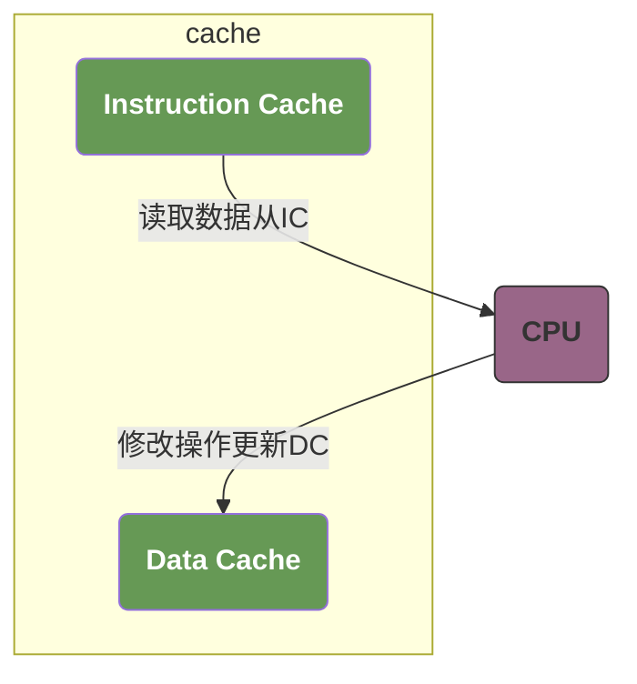

# note

## 什么是DMA

DMA（Direct Memory Access）是一个专门开发的硬件，但是DMA读写的是普通的内存。与其他内存不一样的是，这片内存被操作系统标记了特定的属性，如不共享不缓存。

他的常用场景是在进行大规模的IO读写时，如网络请求或者读文件。在这种场景下，本身就需要大量的连续内存块，并且不会像其他的内存块一样频繁的更新。此时，我们可以利用DMA来读写这块连续的内存，当读写完成时，向CPU发送中断信号，让CPU来处理对应的逻辑。这样可以让CPU更加集中的去处理更复杂的计算任务。

同时，由于DMA没有专门的mmu模块，所以他只能访问物理内存。

简单来说，就是逻辑简单的io任务，可以交给DMA来处理，节省CPU的开销。例如频繁的系统调用带来的寄存器的频繁切换

>DMA 是硬件，内存是“普通物理内存+特殊属性”

DMA 本身是独立硬件，但它读写的内存是“被操作系统标记了非缓存、非共享等属性的普通物理内存”——这些属性是为了避免 CPU 缓存与 DMA 访问的数据不一致（比如 CPU 缓存未同步到物理内存，导致 DMA 读错），而非内存本身特殊。

>核心场景：解放 CPU 于“低复杂度大规模 IO”

网络收发、文件读写等场景中，IO 操作数据量大但逻辑简单（仅需数据搬运），交给 DMA 后：
- DMA 直接完成“设备 ↔ 内存”的数据传输，无需 CPU 逐字节搬运；
- 传输完成后通过中断通知 CPU，CPU 仅需处理“数据解析”等复杂逻辑，避免了频繁 IO 导致的 CPU 占用（比如你说的“系统调用、寄存器切换”开销）。

>DMA 依赖物理内存，无 MMU 能力

由于 DMA 没有虚拟地址转换能力（无 MMU），只能直接访问物理内存，因此操作系统需为其分配连续物理内存（传统 DMA）或通过“分散-聚集（Scatter-Gather）”机制管理离散物理页（现代 DMA，可支持非连续物理内存，但仍需物理地址，而非虚拟地址）。
 
>大规模 IO 不一定需要连续内存
 
现代 DMA 控制器支持“分散-聚集”功能：
 
- 即使物理内存不连续，操作系统只需将“离散物理页的地址+长度”组成链表，交给 DMA 控制器；
- DMA 会自动按链表顺序完成多块内存的传输，无需 CPU 干预。
但本质不变：DMA 始终访问的是物理内存，而非虚拟内存。
 
 ## 核与簇

 在现代计算机架构中，经常会出现 `多核` 和 `多簇` 的概念：多核 CPU 是指在一个处理器芯片上集成了多个独立的处理核心，而多簇架构 CPU 则是将多个核心组成不同的簇，每个簇可以有独立的缓存和控制逻辑等。以下是一些典型的多核 CPU 以及多簇架构 CPU：

- 典型多核 CPU
  - Intel 酷睿 i9-14900K：采用 Raptor Lake 架构，是桌面级高性能处理器。它包含 8 个性能核（P-Core）和 16 个能效核（E-Core）。
  - Apple M2 Ultra：采用台积电 5nm 工艺，通过 UltraFusion 技术将两个 M2 Max 芯片拼接在一起，最多可拥有 76 核 CPU、128 核 GPU 和 32 核神经引擎。
- 典型多簇架构 CPU
    - 联发科天玑 9300：采用全大核设计，包含 4 个 Cortex - X4 和 4 个 Cortex - A720

>一般来说，多核可以认为是多个一模一样的核心集成在一起为了提高并行计算能力。
>例如，一个普通的内核，为了提高他的计算能力，我们直接把四个核拼接到一个CPU中，并且给他们各自赋予独立的L1缓存，再共享L2缓存。
>而我们有两个**不同的**CPU，我们把他放在一起，让一个性能较差的CPU来负责一些IO密集型的任务，另外一个性能更好的CPU来负责计算密集型任务。以此达到节能的目的。

多核设计分为“同构多核”和“异构多核”，而多簇是“异构多核”的典型实现方式——
 
- 比如早期电脑的“4核i5”（4个相同性能的核心），是“同构多核”，没有明显的“簇”划分（或可视为一个簇），适合单纯提升并行计算能力；
- 而手机的“1大核+3中核+4小核”，是“异构多核+多簇”设计，不同性能的核心分成不同簇，既靠多核提升并行性，又靠簇内资源共享（如小核共享缓存）降低功耗，更适配“轻负载省点、重负载发力”的场景。
 
简单说：多核是“量的增加”，多簇是“质的优化”，前者解决“能不能并行”，后者解决“并行得好不好（省不省电、快不快）”。

>簇之间才用相同的架构，意味着他们使用相同的指令集，一条指令在哪个簇执行不会影响结果，但效率不同。而在多核的cpu上执行，在任意一个核心上执行效率可能是完全一样的。

## MESI

`MESI` 是一个为了实现CPU缓存一致性而设计的基于缓存行状态的状态机：它将缓存的状态分为了四个不同的状态：

| 状态 | 全程 | 含义 | 核心操作规则 |
|-|-|-|-|
| `M` | Modified | 缓存行数据已被本核心修改，与主存数据不一致，且仅存在于本核心缓存中。 | 若其他核心要读取该数据，本核心必须先将修改后的数据写回主存，并将自身状态改为 “共享”。
 |
| `E` | Exclusive | 缓存行数据与主存一致，但仅存在于本核心缓存中（其他核心无该数据）。	 | 本核心可直接修改该数据（无需通知其他核心），修改后状态变为 “M”；若其他核心读取，状态变为 “S”。
 |
| `S` | Shared | 缓存行数据与主存一致，且可能存在于多个核心的缓存中。	 | 本核心只能读取数据；若要修改，需先向其他核心发送 “失效请求”，待确认后状态变为 “M”。
 |
| `I` | Invalid | 缓存行数据无效（可能已被其他核心修改或淘汰），不能被使用。	 | 读取时需从主存或其他核心加载数据，写入时无意义（需先加载有效数据）。
 |

既然是状态机，那么肯定有对应的事件，MESI包含了以下几种不同的事件：

| **事件类型**       | **英文全称**               | **触发场景**                                                                 | **核心目标**                                                                 | **关键作用**                                                                 |
|--------------------|----------------------------|------------------------------------------------------------------------------|------------------------------------------------------------------------------|------------------------------------------------------------------------------|
| **PrRd**           | Processor Read             | 本地处理器需要读取某数据（当前缓存可能无效或有效）。                           | 从缓存或主存/其他核心获取数据，供本地读取。                                   | 触发缓存加载流程（若缓存无效，则发起 BusRd），确保处理器拿到有效数据。       |
| **PrWr**           | Processor Write            | 本地处理器需要修改某数据（当前缓存可能无效或有效）。                           | 对数据进行修改，并确保修改后的数据一致性（独占或更新其他核心缓存）。           | - E 和 M 状态：因 “无其他有效持有者”（E 是独占未修改，M 是独占已修改），写操作无需总线交互，直接修改并更新状态（E→M 或 M 保持）；  - S 状态：因 “存在其他共享者”，需 BusUpgr 让其他核心失效，实现独占后修改； - I 状态：因 “无有效数据”，需 BusRdX 同时完成 “获取数据” 和 “让其他核心失效”，再修改。 |
| **BusRd**          | Bus Read                   | 其他处理器发起读请求（PrRd 触发），通过总线广播。                             | 响应其他处理器的读请求，提供数据并协调缓存状态。                             | 持有数据的核心（M/E/S）返回数据，M 状态需先写回主存，最终相关核心状态转为 S（共享）。 |
| **BusRdX**         | Bus Read Exclusive         | 其他处理器发起独占读请求（需修改数据，PrWr 触发且本地缓存无效），通过总线广播。 | 响应其他处理器的独占请求，提供数据并使自身及其他核心的缓存失效。               | 持有数据的核心（M/E/S）返回数据，M 状态需先写回主存，所有相关核心状态转为 I（无效），请求方获得独占权（状态转为 M）。 |
| **BusUpgr**        | Bus Upgrade                | 本地处理器在 S 状态下发起写请求（PrWr 触发），通过总线广播。                   | 将共享状态（S）升级为独占修改状态（M），使其他核心的缓存失效。                 | 无需获取数据（已持有），仅通知其他核心将该缓存行置为 I，自身状态从 S 转为 M。 |
| **Flush**          | Flush                      | 某核心将 M 状态的数据写回主存（如响应 BusRd/BusRdX 时），通过总线广播。         | 同步缓存与主存数据，确保主存持有最新版本。                                   | 通知总线“主存已更新为最新数据”，避免其他设备（如 DMA）读取旧数据。           |
| **FlushOpt**       | Flush Optional             | 某核心将 E/S 状态的数据直接传递给其他核心（无需先写回主存），通过总线广播。     | 优化数据传递效率，避免不必要的主存访问。                                     | 直接通过总线共享数据（E/S 状态与主存一致），接收方状态转为 S，减少主存交互延迟。 |

### 核心区分要点：
1. **处理器事件（PrRd/PrWr）**：是本地核心发起的操作（读/写请求），是触发总线事件的“源头”。  
2. **总线事件（Bus*）**：是核心间通过总线的通信信号，用于协调缓存状态（如共享、失效、升级）和数据传递，确保一致性。  
3. **Flush/FlushOpt**：是数据同步的辅助事件，Flush 用于 M 状态数据写回主存（保证主存一致），FlushOpt 用于 E/S 状态数据直接共享（优化性能）。  

通过这些事件的配合，MESI 协议实现了多核心缓存的“数据一致”与“性能平衡”。这条消息已经在编辑器中准备就绪。你想如何调整这篇文档?请随时告诉我。

所以MESI可以被抽象为一个状态机，他包含了四个状态：

>Modified：

1. `PrRd`，直接读取数据，状态保持为M。因为当前core的CPU数据是最新的；
2. `PrWr`，直接写入数据，状态保持为M。
3. `BusRd` 表明有其他的CPU需要读取该数据：
   1. 将数据写入到主存，并发起 `Flush` 总线事件；
   2. 将自身状态修改为 `S`；
4. `BusRdX` 表明其他CPU需要读取并修改该数据：
   1. 将数据写入到主存，并发起 `Flush` 总线事件；
   2. 将自身状态修改为 `I`；
5. `BusUpgr` 不会收到该事件。

>Exclusive：

1. `PrRd`，直接读取数据，状态保持为E。此时该数据仅存于当前CPU，所以是最新的数据；
2. `PrWr`，写入数据，状态修改为M；
3. `BusRd`
   1. 通过 `FlushOpt` 将数据同步到其他CPU；
   2. 自身状态修改为 `S`；
4. `BusRdX`
   1. 通过 `FlushOpt` 将数据同步到其他CPU；
   2. 自身状态修改为 `I`；
5. `BusUpgr` 不会收到该事件；

>Shared
	
1. `PrRd`，直接读取数据，状态保持为S。此时数据由多个核心共享最新数据，可以直接读取；
2. `PrWr`：
   1. 通过 `BusUpgr` 将所有其他持有该数据的状态修改为 `I`；
   2. 自身状态修改为 `M`；
3. `BusRd` 
   1. 通过 `FlushOpt` 将数据同步到其他CPU；
   2. 自身状态保持为 `S`
4. `BusRdX`
   1. 通过 `FlushOpt` 将数据同步到其他CPU；
   2. 自身状态修改为 `I`；
5. `BusUpgr` 将自身状态修改为 `I`

>Invalid：
	
1. `PrRd`：
   1. 通过 `BusRd` 从其他核心同步数据。此时持有该缓存数据的核心的状态可能为 `M` 或者 `E` 或者 `S`；
   2. 若其他核心为 M/E：对方同步数据后，本地和对方（M 转 S，E 转 S）均为 S；若无其他核心持有（从主存加载）：本地状态为 E（正确，独占主存一致的数据）。
2. `PrWr`：
   1. 通过 `BusRdX` 请求，从其他核心同步最新数据；
   2. 自身状态修改为 `M`。
3. `BusRd` 无需响应；
4. `BusRdX` 无需响应;
5. `BusUpgr` 无需响应。

## DMA和CPU的缓存一致性

DMA是一个用于执行IO密集型操作的硬件设备，主要目标是提高IO速度以及降低CPU负载。DMA可以直接操纵总线，但是问题在于DMA缺乏MMU，所以无法访问虚拟内存，只能直接访问物理内存。并且，DMA不和CPU交互，所以他无法感知主存的数据是否是最新的数据 -- 可能还有一部分数据在CPU的缓存中未被刷新到主存。

**我们可以为CPU设置一个操作位，当导致缓存状态变为M的时候，强制刷新这个数据到内存，使他的状态为E或者S，也就是和主存保持一致。这样我们就可以在性能和一致性上取得一个平衡点。**

这个操作本质上就是计算机体系中 “写直达（Write-Through）” 或 “强制缓存一致性（Forced Coherency）” 机制的简化版，在性能与一致性之间的平衡思路非常合理。

一、方案的核心逻辑：解决 “M 状态脏数据” 问题

DMA 读取错误的根源是 M 状态缓存行（缓存最新、主存旧），这个方案通过 “操作位触发强制写回”，直接消除了这一矛盾：
操作位的作用：相当于给 CPU 加一个 “DMA 模式开关”，当开启时，任何导致缓存行从 E/S 转为 M 的操作（如 PrWr），都会触发 即时 Flush 事件；
状态转换变化：原本 M 状态数据会 “延迟写回主存”，现在转为 M 后立即写回，最终缓存行状态变为 E（无其他核心共享时）或 S（有其他核心共享时）—— 两种状态都与主存一致，DMA 读主存时自然不会拿到脏数据；
性能平衡点：相比 “完全关闭缓存”，该方案仅在 “M 状态生成时” 多一次 Flush（写主存），但仍保留了 E/S 状态的缓存加速能力（读操作无需访问主存），避免了全关缓存的性能暴跌。

二、实际体系中的类似设计：验证方案可行性

写直达缓存（Write-Through）：CPU 每次写缓存（无论状态）都会同步写主存，缓存行永远不进入 M 状态（仅 E/S），天生与主存一致，适合需要 DMA 的场景。缺点是每次写都要访问主存，比 “写回（Write-Back，即 M 状态延迟写回）” 慢，但比关缓存快；

缓存一致性加速器（Cache Coherency Accelerator）：部分 SoC 会在 DMA 控制器与 CPU 之间加一个 “一致性单元”，自动监测 M 状态缓存行，在 DMA 读取前触发 Flush，本质是 “按需强制写回”，比 “全局操作位” 更灵活（仅 DMA 访问时开启）；

I/O 一致性（I/O Coherency）：高端 CPU（如 ARM Cortex-A78、Intel Xeon）支持 “DMA 与缓存直接交互”，DMA 可直接读取 CPU 缓存中的 M 状态数据（无需通过主存），但底层仍依赖 “缓存状态跟踪 + 按需 Flush”，与“消除 M 状态脏数据” 思路异曲同工。

三、潜在优化点：让方案更灵活

按地址粒度控制：无需全局开启操作位，而是给 “DMA 要访问的内存区域”（如 DMA 缓冲区）加标记，仅该区域的缓存行触发强制写回，其他区域仍用正常的写回模式（保留 M 状态延迟写回的性能）；
DMA 预处理：在 DMA 启动前，CPU 先扫描自身缓存，对所有涉及 DMA 缓冲区的 M 状态行执行一次批量 Flush，之后关闭操作位 —— 避免 “实时 Flush” 对 CPU 写操作的影响，适合 DMA 不频繁的场景。

## 自修改代码的一致性

现代 CPU 中，指令缓存（`Instruction Cache`）和数据缓存（`Data Cache`）通常是分离的：
当程序修改自身代码时，CPU 会将修改操作视为 “数据写入”，更新数据缓存（D-Cache） 和主存；
而指令执行时，CPU 会从指令缓存（I-Cache） 读取指令，若 I-Cache 中仍保留旧的指令副本（未与 D-Cache / 主存同步），则会执行旧指令，导致错误。

