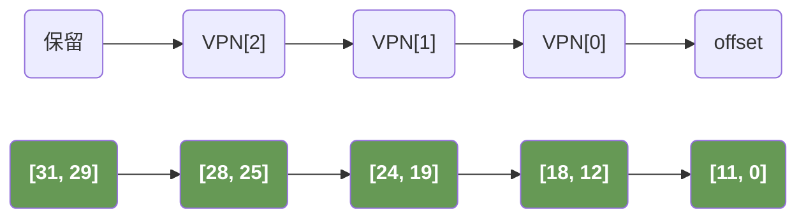
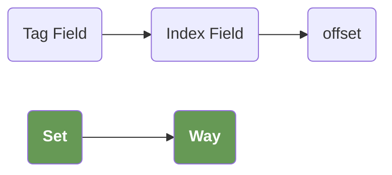

# TLB(Translation Lookaside Buffer)

## VA

虚拟地址在**通过页表查询物理内存信息**和**通过TLB查询物理内存信息**这两个过程中，他的划分是不一样的。假设我们是一个32位的虚拟地址，每个页帧的大小是4kb，那么在实际的划分中，我们的虚拟地址可能会被按照两种不同的方式划分。

>**NOTE** 物理地址在访问高速缓存的时候，也会被拆分成标记域和索引域。

虚拟地址的最宽泛的构成是，VPN + offset，其中 offset 和页帧的大小有关。VPN和页表的级数有关。

例如，对于一个三级页表，那么VPN会被分为四个部分，分别是：

1. 保留部分；
2. 一级页表索引；
3. 二级页表索引；
3. 三级页表索引，通过这一级页表可以查到对应的 PFN，加上VA中的offset就能定位到具体的物理地址。

然而，当我们在查询TLB的时候，它会被分为三个部分

1. 标记域；
2. 索引域；
3. offset；

我们使用索引域到TLB中去定位到一个组，随后用标记域去定位到一个路，并从路中获取到PFN以及对应的权限信息，加上offset就能访问到一个物理地址。

**重要的是，标记域和索引域的构成和页表没有任何关系。只取决于TLB的硬件实现。例如，如果是一个128组的TLB实现，那么我们的高7位就是标记域，用来定位组。而剩下的位就是用来定位路。**

>通过MMU查询物理地址



>通过TLB查询虚拟地址




## Way && Set

TLB（Translation Lookaside Buffer）中的“路（Way）”和“组（Set）”是描述其**组相联结构**的核心概念，用于平衡查找速度与硬件复杂度。它们的设计思路与高速缓存（Cache）的组相联结构完全一致，目的是在“直接映射”（速度快但冲突率高）和“全相联”（冲突率低但查找慢）之间找到折中方案。


### 一、组（Set）：TLB的“分组”，用于缩小查找范围

- **定义**：组是TLB内部划分的若干个“子集合”，每个组包含若干个TLB表项（Entry）。  
- **作用**：通过虚拟地址中的“索引域（Index）”直接定位到某个组，避免遍历整个TLB，从而加速查找。  
- **数量**：组的数量由TLB的设计决定（如32组、64组、128组等），通常是2的幂次（方便用二进制索引定位）。  

例如：若TLB有128个组，则索引域需要7位（2⁷=128），虚拟地址的索引部分会直接指向第0~127组中的某一组。

### 二、路（Way）：每组内的“并行表项”，用于降低冲突

- **定义**：路是每个组内部包含的“并行TLB表项”，所有组的路数相同。  
- **作用**：每组内的多路表项可以存储多个不同的虚拟页映射，避免“同一索引的不同虚拟页”因竞争同一组而频繁替换（即减少冲突未命中）。  
- **常见路数**：2路、4路、8路等（如“4路组相联TLB”表示每个组有4个表项）。  

例如：4路组相联TLB中，每个组包含4个表项（4路），每个表项存储一个“虚拟页号→物理页号”的映射及属性（如权限、有效位等）。


### 三、组相联TLB的结构与查找流程（结合组和路）
假设一个“4路组相联、128组”的TLB，其结构和查找过程如下：  

#### 1. 结构示意

```
┌───────────────────────────────────────────┐
│  组0（Set 0）                             │
│  ┌─────────┐  ┌─────────┐  ┌─────────┐  ┌─────────┐  │
│  │ 路0     │  │ 路1     │  │ 路2     │  │ 路3     │  │  ← 每组4路
│  │（表项）  │  │（表项）  │  │（表项）  │  │（表项）  │  │
│  └─────────┘  └─────────┘  └─────────┘  └─────────┘  │
├───────────────────────────────────────────┤
│  组1（Set 1）                             │  ← 共128组
│  （同上，4路表项）                          │
├───────────────────────────────────────────┤
│  ...（中间125个组）                         │
├───────────────────────────────────────────┤
│  组127（Set 127）                          │
│  （同上，4路表项）                          │
└───────────────────────────────────────────┘
```


#### 2. 查找流程（虚拟地址→物理地址）

1. **拆分虚拟地址**：  
   虚拟地址分为三部分：`标记域（Tag）` + `索引域（Index）` + `页内偏移（Offset）`。  
   - 索引域（如7位）决定要访问的组（如第N组）；  
   - 标记域（剩余高位）用于在组内匹配具体的表项。  

2. **定位组**：  
   用索引域的值找到对应的组（如第N组）。  

3. **组内比对标记**：  
   遍历该组内所有路（如4路）的表项，将每个表项的标记与虚拟地址的标记域比对：  
   - 若某路表项的标记匹配且有效（Valid位为1），则TLB命中，取出该表项的物理页号（PPN），与页内偏移拼接成物理地址；  
   - 若所有路的标记均不匹配，则TLB未命中，需去主存查询页表。  


### 四、核心作用：平衡速度与冲突率
- **组的作用**：通过索引直接定位组，避免全表遍历，保证查找速度（类似数组下标访问）；  
- **路的作用**：每组内的多路表项允许存储多个映射，降低“不同虚拟页映射到同一组”的冲突概率（相比直接映射TLB，冲突未命中更少）。  

例如：直接映射TLB（1路组相联）中，每个组只有1路，同一索引的虚拟页会互相替换，冲突率高；而8路组相联TLB中，每个组有8路，可同时存储8个映射，冲突率显著降低，但硬件复杂度更高（需同时比对8个标记）。


### 总结
- **组（Set）**：TLB的“子集合”，由索引域定位，用于缩小查找范围；  
- **路（Way）**：每组内的“并行表项”，用于存储多个映射，降低冲突；  
- 两者结合构成“组相联TLB”，是现代CPU中虚拟地址转换的高效实现方式，兼顾速度与灵活性。

## Tag Field && Index Field

在虚拟内存管理中，TLB（Translation Lookaside Buffer，转换检测缓冲区）是CPU用于加速虚拟地址到物理地址转换的缓存，其内部结构类似高速缓存，包含**标记域（Tag Field）** 和**索引域（Index Field）**，两者共同配合完成地址匹配和快速查找。


### 一、TLB 的核心作用

TLB 存储近期使用的“虚拟页号（VPN）→ 物理页号（PPN）”映射关系，以及页表项的其他属性（如读写权限、缓存策略等）。当CPU访问虚拟地址时，首先查询TLB：若命中（找到匹配的映射），直接用物理页号完成地址转换；若未命中，再去主存查询页表（速度慢得多）。


### 二、标记域（Tag Field）

- **定义**：标记域是TLB表项中用于**唯一标识一个虚拟页**的字段，通常由虚拟地址中“虚拟页号（VPN）的高位部分”组成。
- **作用**：在TLB查找时，用于与输入的虚拟地址中的对应部分比对，确认是否命中。
- **来源**：虚拟地址被划分为“虚拟页号（VPN）”和“页内偏移（Offset）”，其中VPN进一步拆分为“标记（Tag）”和“索引（Index）”（具体拆分取决于TLB的关联度）。

  例如：假设虚拟地址为32位，页大小4KB（页内偏移12位），则VPN为高20位。若TLB是4路组相联，共128组，则VPN的低7位作为索引（128=2⁷），高13位作为标记（20-7=13）。


### 三、索引域（Index Field）
- **定义**：索引域是虚拟地址中用于**定位TLB组（Set）** 的字段，由虚拟页号（VPN）的低位部分组成。
- **作用**：TLB通常采用“组相联”结构（如2路、4路组相联），内部被划分为多个“组”，每个组包含若干个“表项（Entry）”。索引域的值直接决定要查询哪个组，缩小查找范围（无需遍历所有表项）。
- **与标记域的配合**：
  1. 用索引域定位到TLB中的目标组；
  2. 遍历该组内的所有表项，将每个表项的标记域与虚拟地址的标记部分比对；
  3. 若某表项的标记与输入标记一致，且该表项有效（Valid位为1），则TLB命中，用该表项的物理页号完成转换。


### 四、举例说明（以32位虚拟地址为例）
假设：
- 页大小 = 4KB → 页内偏移 = 12位（2¹²=4096）；
- TLB为4路组相联，共128组 → 索引域 = 7位（2⁷=128组）；
- 虚拟页号（VPN）= 32-12=20位 → 标记域 = 20-7=13位。

虚拟地址结构拆分：
```
┌─────────────────┬────────────┬─────────────┐
│  标记域（13位）  │ 索引域（7位）│ 页内偏移（12位）│
└─────────────────┴────────────┴─────────────┘
   （来自VPN高位）  （来自VPN低位）   （直接用于物理地址）
```

TLB查找流程：
1. 从虚拟地址中提取“索引域（7位）”，定位到TLB的第N组；
2. 从虚拟地址中提取“标记域（13位）”，与第N组内4个表项的标记域逐一比对；
3. 若某表项标记匹配且有效，则命中，取出该表项的物理页号（PPN），与页内偏移拼接成物理地址；
4. 若未匹配，则TLB未命中，触发页表查询。


### 五、核心总结
- **索引域**：用于“快速定位TLB组”，减少查找范围，类似数组下标；
- **标记域**：用于“在组内精确匹配虚拟页”，确保找到唯一对应的物理页映射；
- 两者结合使TLB能在纳秒级完成地址转换，是虚拟内存高效运行的关键。

不同架构的TLB关联度（如直接映射、全相联）会影响标记域和索引域的位数分配，但核心逻辑一致。

## VIVT, VIPT, PIPT

- VI = `Virtual-Indexed`
- PT = `Physical-Tagged`

“不同虚拟页映射到同一物理页” 的场景，不仅存在于多进程间，单个进程内部也可能发生。核心原因是 “虚拟地址空间的设计灵活性”—— 操作系统或编译器会出于 “内存复用”，“共享” 或 “特殊功能” 的需求，将多个虚拟页映射到同一物理页，最终导致 VIVT 缓存的重名问题。以下分场景拆解：

### 一、多进程场景：共享物理页是常态

不同进程的虚拟地址空间是独立的（如进程 A 的 0x1000 和进程 B 的 0x1000 是不同虚拟地址），但操作系统会为了 “节省物理内存” 或 “实现数据共享”，将它们的部分虚拟页映射到同一物理页，典型场景包括：

- 共享库 / 动态链接库：
  - 多个进程同时使用的库（如 C 标准库libc.so），操作系统不会为每个进程都加载一份物理副本，而是让所有进程的 “库虚拟页” 映射到同一物理页。
- 进程间通信（IPC）的共享内存：
  - 进程通过shmget（Linux）等接口创建共享内存时，操作系统会为这些进程分配 “各自的虚拟页”，但映射到 “同一块物理页”，实现数据互通。


### 二、单进程场景：也可能存在 “多虚拟页→同一物理页” 映射

- 内存映射文件（mmap）的 “重复映射”：进程通过mmap将同一文件的 “不同部分” 映射到进程虚拟地址空间的 “不同虚拟页”，但如果文件的 “同一物理块” 被映射到多个虚拟页（如文件偏移重复），就会导致这些虚拟页对应同一物理页。
- 页表映射的 “刻意复用”：某些特殊场景（如内存压缩、虚拟化）中，操作系统可能会临时将进程内的多个虚拟页映射到同一物理页（如暂时复用物理页存储相同内容），后续再根据需求调整。
  - **这里最典型的场景是 copy-on-write**

## sfence.vma(Synchronizing FENCE for Virtual Memory Addresses)

sfence.vma 是 RISC-V 架构中用于同步虚拟内存地址转换（Virtual Memory Address Translation） 的指令，主要作用是确保对页表的修改（如更新 PTE、切换页表）能被 CPU 核和相关硬件（如 TLB、缓存）及时感知，避免因旧的地址映射缓存导致的一致性问题。

### 一、为什么需要 sfence.vma？

CPU会通过 TLB 缓存**虚拟内存 -> 物理内存**的映射关系，但是在某些情况下，这个映射关系会改变，例如：

1. 之前malloc的内存free之后，这个内存已经失效了；
2. 切换进程地址空间；

此时，TLB中仍然缓存了这个地址，此时访问该虚拟地址可能导致异常。sfence.vma 的核心功能就是强制刷新相关的 TLB 缓存和地址转换状态，确保后续的地址转换使用最新的页表信息。


### 二、sfence.vma 的具体作用

- TLB 失效：使 CPU 核中缓存的、与 “指定虚拟地址或地址空间” 相关的 TLB 表项失效（不再被使用）；
- 指令 / 数据同步：确保对页表的修改（如写入新的 PTE）已被全局可见（如从写缓冲区刷入主存），避免硬件使用旧的页表数据；
- 多核心同步：在多核系统中，可确保其他核心的 TLB 也能感知到页表的修改（部分场景需配合其他机制）。


### 三、sfence.vma 的使用场景


当操作系统执行以下操作时，必须使用 sfence.vma 确保地址转换的一致性：

- 修改 PTE 内容：如更新虚拟页到物理页的映射（如 COW 复制、内存回收）、修改页的权限（如从 “只读” 改为 “可写”）；
- 切换页表根地址：如进程切换时更新 satp 寄存器（RISC-V 中存储页表基地址的寄存器）；
- 释放物理页：当物理页被回收并分配给其他虚拟页时，需失效旧虚拟页对应的 TLB 表项。

### 四、指令格式与参数


```asm
# rs1：指定 “虚拟地址”（若为 x0，则表示所有虚拟地址），仅使与该虚拟地址相关的 TLB 表项失效；
# rs2：指定 “地址空间标识符（ASID）”（若为 x0，则表示所有 ASID），仅使该 ASID 对应的 TLB 表项失效。

#x0 是 RISC-V 中的零寄存器（永远存储 0），当它作为 sfence.vma 的参数时，会触发 “全局范围” 的 TLB 刷新。
sfence.vma rs1, rs2
```

常见用法：

- `sfence.vma x0, x0`：刷新所有虚拟地址、所有 ASID 的 TLB 表项（最彻底，也最常用）；
- `sfence.vma a0, x0`：仅刷新 a0 寄存器中虚拟地址对应的 TLB 表项（更高效，针对性刷新）。

## ASID溢出了怎么办？

ASID（地址空间标识符）由操作系统内核生成并管理，它并非无限量供应 —— 因为硬件为 ASID 分配的位数是固定的（例如 8 位 ASID 支持 256 个不同值），因此其数量受硬件设计限制。

ASID 通过位图等机制分配和回收（如内核用位图记录已使用的 ASID，分配时选取未使用的值，进程退出后回收）。当活跃进程数超过 ASID 最大数量（即 ASID 溢出）时，内核会复用已分配给其他活跃进程的 ASID，此时需要刷新 TLB 中该 ASID 对应的旧表项（或全局刷新 TLB），避免新旧进程的地址映射冲突，而非 “重新生成 ASID”。

内核在进程的内存描述符（mm_struct）的  `context.id` 中保存当前进程的 ASID。当进程切换时，内核会将mm->context.id赋值到 CPU 的ASID 专用寄存器（而非satp寄存器）中，使硬件能识别当前地址空间。

此外值得注意的是，进程是软件层面的抽象概念，硬件并不直接感知 “进程” 的存在，仅通过 ASID、页表根地址（存储在satp等寄存器中）等信息区分不同的地址空间，确保地址转换的正确性。

## BBM(Break-Before-Make) 为什么在开始之前要使用一个失效的PTE代替原本的PTE

>在多核系统中，多个虚拟地址可以同时映射到同一个物理地址，出现为同一个物理地址创建多个TLB项的情况，更改其中一个页表项会破坏缓存一致性以及内存访问时序等，导致系统出问题。例如，若把一个旧的页表项替换为一个新的页表项，操作系统通常使用BBM（Break-Before-Make，先断开后更新）机制来保证TLB的正确；

当我们需要修改一个页表项的时候，这个页表项可能会有其他的线程也在使用它（其他的进程不可能，因为其他的进程我当前进程的ASID不一样），此时我们有两个不同的选择：

1. 加锁；
2. 先删除对应的PTE，这样访问该PTE的线程会触发一个缺页异常，而操作系统在缺页异常中会保证串行执行。

在多核系统中，对页表项的访问是跨核心并行的（不同 CPU 核心可同时访问同一虚拟地址，触发对同一页表项的 TLB 查询或页表遍历）。此时 “加锁” 方案存在两个致命缺陷：

- 锁的粒度问题：若为单个页表项加锁，锁的数量会与页表项数量一致（可能达百万级），硬件无法实现；若扩大锁粒度（如整个页表加锁），会导致多核并发性能暴跌（所有核心访问页表都需排队）。
- TLB 的 “无锁访问” 特性：TLB 是硬件缓存，访问时无需经过软件锁同步。即使页表项加锁，其他核心仍可能通过 TLB 缓存的旧映射直接访问物理页，导致锁失效（TLB 访问绕开了软件锁）。

当用无效页表项（如 Valid 位清 0）替换旧项后，任何访问该虚拟地址的操作都会触发缺页异常（Page Fault），而缺页异常的处理具有天然的 “串行化” 特性：

1. 暂停并行访问：无论哪个核心、哪个线程访问该虚拟地址，都会因页表项无效而陷入内核，暂停用户态执行，进入异常处理流程。
2. 内核统一仲裁：所有触发异常的线程会在 kernel 态排队处理（内核通过进程调度或锁机制确保串行处理），此时内核可安全地完成 “旧映射清理→新映射建立” 的完整流程。
3. 避免 TLB 旧映射干扰：即使其他核心的 TLB 中仍缓存旧映射，当它们访问该虚拟地址时，硬件会先检查页表项的有效性 —— 由于页表项已被标记为无效，TLB 中的旧映射会被视为 “不可信”，强制触发页表遍历（进而发现无效项，陷入异常），避免旧映射被错误使用。

## 没有BBM可能引发的异常

假设主进程有两个线程——线程0和线程1，线程0运行在CPU0上，线程1运行在CPU1上，它们共同访问一个虚拟地址。这个VMA（Linux内核采用vm_area_struct数据结构来描述一段进程地址空间）映射到Page0上。

主进程通过fork调用创建一个子进程。子进程对应的页表项为PTE1，它通过写时复制得到一个新的VMA1，而且这个VMA1也映射到Page0。在fork过程中，对父进程和子进程的页表项都会设置只读属性(PTE_RDONLY)。

当线程1想往该虚拟地址中写入新代码时，它会触发写错误的缺页异常，在Linux内核里执行写时复制操作。线程1创建了一个新的页面Page_new，并且把Page0的内容复制到Page_new中，然后切换页表项并指向Page_new，最后往Page_new中写入新代码。

此时，在CPU0上运行的线程0的指令和数据TLB依然指向Page0，线程0依然从Page0上获取指令，这样线程0获取了错误的指令，从而导致线程0运行错误，

>在这段描述中，如果我们不使用BBM，那么在线程1修改了PTE之后，线程0的CPU的TLB中仍然保留了一个错误的缓存，会导致访问异常。
>而如果我们使用BBM机制的话，即使线程1将PTE设置为无效后，在访问新的内存地址之前。线程0去访问新的地址，它也会触发一个缺页异常，并由操作系统将虚拟内存地址指向新的合法物理内存地址。