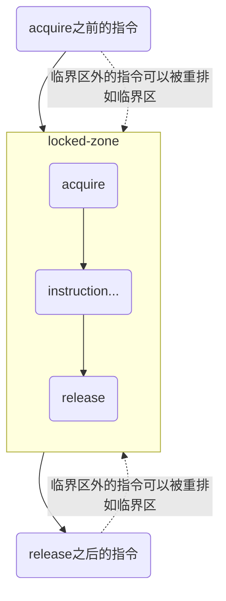

# 内存屏障指令

## 术语

- `PO` Program Order
- `MO` Memory Order
- `MCM` Memory Consistency Model
- `MCA` Multi-Copy Atomicity 在多核处理器系统中，如果一个本地写操作被其他任意一个观察者（如其他CPU）观察到写入完成，那么系统中所有的观察者都能观察到写入完成；
- `Non-MCA` Non-Multi-Copy Atomicity 不能保证处理器的写操作立即被其他观察者观察到，这会导致系统变得复杂。
- `RVWMO` RISC-V Weak Memory Ordering 基于释放一致性内存模型以及MCA模型构建的，提供相对宽松的内存访问约束条件，简化了处理器设计并提升了处理器性能
- `RVTSO` RISC-V Total Store Ordering 
- `GMO` Global Memory Order 指的是站在内存角度看到的读和写操作的次序；
- `PPO` Preserved Program Order 保留程序次序指的是在全局内存次序中必须遵守的一些与内存次序相关的规范和约束

## 自旋锁

下面的代码中：

1. 我们通过 `lr.d.aq` 来读取 `(s1)` 中的数据，并且我们通过 `.aq` 来保证：
    - 后续的**所有**内存操作都不能被排到当前指令之前
    - 确保本次读取操作（从内存到 s5）能获取到该内存地址（s1 指向的锁变量）的最新值，包括其他线程通过 release 语义（如 sc.d.rl）写入的所有更新
2. 锁被占用，自旋；
3. 通过 `sc.d.rl` 来获取锁，并且我们通过 `.rl` 来保证：
    - sc.d.rl 之前的所有内存操作（加载 / 存储）不能被重排到 sc.d.rl 之后。
    - sc.d.rl 写入 (s1) 的值（即 “锁已被当前线程获取” 的标记）会被强制同步到全局可见的缓存 / 主存，确保其他线程通过 acquire 语义（如 lr.d.aq）能读到该更新
4. 获取锁失败，自旋；
5. 进入临界区，开始操作

```asm
loop:
    lr.d.aq s5, (s1)            ; load reserved with acquire
    beq a5, s0, loop            ; if (a5 != s0) goto loop

    sc.d.rl a1, s0, (s1)        ; store conditional with release
    bnez a1, loop               ; if (a1 != 0) goto loop
    
    sd x1, (a1)                 ; 临界区里的存储指令
```

## 为什么需要内存屏障指令

>编译器和硬件只能识别显式依赖（通过代码语法可直接分析的依赖），而对隐式依赖（逻辑上存在依赖，但语法上无直接关联）完全无法感知，这正是内存屏障必须介入的场景：

内存屏障的核心价值确实体现在 “弱一致性模型下，解决编译器 / 硬件无法自动识别的依赖关系，保证跨线程 / 跨设备的执行顺序符合预期”。

在我们的代码执行过程中，我们需要注意的是那种，有依赖关系，但是从静态代码分析的角度无法分析出来的情况。

例如，对于如下的代码编译器可以识别出来他们的依赖关系，所以无需使用内存屏障：

```c++
a = 1;
b = a;
```

而下面的情况，他们有明确的依赖关系，但是编译器无法识别：

1. CPU把数据写入到内存的DMA区域；
2. 设置DMA寄存器激活DMA复制数据；

此时，由于 1 和 2 有强依赖关系，如果不使用内存屏障则可能出现时序问题。

### 对 “DMA 操作” 例子的深度解析：为什么必须用内存屏障？

>隐式依赖的本质：“逻辑顺序” vs “语法顺序”

- 代码层面：写入DMA内存（操作 A）和设置DMA寄存器（操作 B）是两条独立指令（比如 A 是store 内存地址, 数据，B 是store 寄存器地址, 1），语法上无任何数据 / 控制依赖；
- 逻辑层面：B 必须在 A 之后执行 —— 如果 B 先执行（DMA 被提前激活），此时 A 还没写完数据，DMA 会复制到错误的旧数据，导致硬件操作失败。

>弱一致性模型下的风险：编译器 / 硬件会重排这两条指令

在弱一致性模型（如 RVWMO、ARM 的弱序）中，由于 A 和 B 无显式依赖：

- 编译器可能将 B 重排到 A 之前（优化指令顺序，减少流水线阻塞）；
- CPU 可能乱序执行（先执行 B 的 store，再执行 A 的 store）；
- 缓存可能延迟同步（A 的写入还在缓存中，B 已执行，DMA 控制器从内存读不到 A 的新数据）。

>内存屏障的作用：强制恢复逻辑顺序

必须在 A 和 B 之间插入写 - 写屏障（Store-Store Barrier），告诉硬件 / 编译器：“A 必须在 B 之前完成，不能重排”。

```asm
# 操作A：写入DMA内存
sw x10, 0(x20)  # 数据写入DMA缓冲区
# 内存屏障：确保A的写操作完成后再执行B
fence w,w
# 操作B：激活DMA
sw x11, 4(x20)  # 设置DMA控制寄存器为"启动"
```

>其他常见 “隐式依赖” 场景（进一步验证你的理解）

1. 设备寄存器操作
   - 先向网卡发送缓冲区写数据（A），再写 “发送命令” 寄存器（B）
2. 多线程信号量通信
   - 线程 A 写共享变量data=100（A），再设置flag=1通知线程 B（B）；线程 B 循环等flag=1（C），再读data（D）。
3. 无锁数据结构
   - 先更新链表节点next指针（A），再设置head指针指向新节点（B）。

### 

## PO 和 MO

### 一、Program Order（程序顺序）

>程序顺序指的是源代码中指令的书写顺序，即程序员在代码中定义的指令执行先后关系。

对单线程程序而言，处理器会尽可能按照程序顺序执行指令（忽略编译器和硬件的优化），以保证程序的逻辑正确性。例如：

```c++
a = 1;    // 指令1
b = a + 1; // 指令2
```

程序员预期 “指令 1 先执行，指令 2 后执行”，因此b的结果应为2，这就是程序顺序的直观体现。

但在多线程或优化场景下，程序顺序可能被打破（见下文 “内存顺序”）。

### 二、Memory Order（内存顺序）

>内存顺序指的是指令在内存系统中的**实际执行顺序**和**可见性规则**，即不同线程（或处理器核心）观察到的指令执行顺序。

它由两部分决定：

- 编译器优化：编译器可能对指令重排序（如调整读写顺序）以提高效率，只要不改变单线程的执行结果（遵循 “as-if-serial” 语义）。
- 处理器硬件优化：CPU 可能采用流水线、乱序执行（Out-of-Order Execution）等技术，让指令实际执行顺序与程序顺序不同，但保证单线程内的逻辑正确。

### 三、核心差异：单线程 vs 多线程

- 单线程中：程序顺序和内存顺序通常是一致的（或表现为一致）。编译器和硬件的重排序不会破坏单线程的执行结果，因此程序员无需关心内存顺序。
- 多线程中：程序顺序和内存顺序可能不一致，导致 “线程间可见性问题”

```c++
// 线程1
a = 1;    // 指令1
flag = 1; // 指令2

// 线程2
while (flag == 1) {
    printf("%d", a); // 可能打印0？
}
```

从程序顺序看，线程 1 的 “指令 1 先于指令 2”，线程 2 预期flag=1时a已为1。但实际中：

- 编译器可能将线程 1 的指令 2 重排到指令 1 之前；
- CPU 乱序执行可能让指令 2 先写入内存。

此时线程 2 可能看到flag=1但a=0，这就是内存顺序与程序顺序不一致导致的问题。

### 四、为什么需要关注内存顺序？

多线程程序中，若不通过内存屏障（Memory Barrier） 或原子操作的内存顺序约束（如 C++11 的std::memory_order）控制内存顺序，可能出现：

- 重排序：指令执行顺序与程序顺序不符；
- 可见性问题：一个线程的写入结果不能及时被其他线程看到（因 CPU 缓存未同步）。

内存顺序的规则（如顺序一致性、释放 - 获取语义等）正是为了规范多线程间的内存交互，保证并发程序的正确性。

## RVWMO && RVTSO && GMO && PPO

### RVWMO

- 定义与目标：RVWMO 旨在为架构师提供构建高性能可扩展设计的灵活性，同时支持易于处理的编程模型。它定义了一个 load 可以返回什么样的值，规定了软件和硬件实现之间的一种契约，明确了哪些内存操作行为是允许的。
- 执行顺序特点：在 RVWMO 下，从同一硬件线程（hart）内的其他内存指令视角来看，单 hart 上运行的代码是按顺序执行的。但来自其他 hart 的内存指令可能会观测到第一个 hart 的内存指令以不同顺序执行。因此，多线程代码可能需要显式同步来保证不同 hart 间内存指令的执行顺序。
- 组成部分：
  - 保留程序顺序（preserved program order，PPO）：任何给定的程序执行的全局内存顺序都遵循每个 hart 的部分程序顺序，这个必须遵守的程序顺序的子集称为保留程序顺序。它由重叠地址排序、显式同步、语法依赖和流水线依赖等组成。
  - 内存模型公理（memory model axiom）：包括加载值公理（load value axiom）、原子性公理（atomicity axiom）和进展公理（progress axiom）。加载值公理定义了 load 指令可以返回的值必须是在全局内存顺序以及在当前线程程序顺序中的最后一条 store 指令所写入的值。
- 相关扩展：标准 ISA 扩展 “Zam”（未对齐原子操作扩展）和 “Ztso”（全存储排序扩展）通过针对各自扩展的附加规则对 RVWMO 进行了增强。为了方便从其他体系结构移植代码，一些硬件实现可能会选择实现 Ztso 扩展，该扩展在默认情况下提供更严格的 RVTSO 排序语义。

### RVTSO

RVTSO 是 RISC-V 提供的一种比 RVWMO（RISC-V Weak Memory Ordering）更严格的内存一致性模型。它主要是为了便于从 x86 体系结构向 RISC-V 迁移，提供了完全兼容 x86 架构的内存模型。在 RVTSO 模型中，存储操作会按照程序顺序对所有处理器核心可见，这意味着一个核心的存储操作在对其他核心可见时，所有核心都会看到相同的顺序，从而提供了更强的内存一致性保证。

## 产生内存乱序访问的原因是什么

内存乱序访问（Memory Out-of-Order Access）是指 CPU 或编译器对内存操作（读取 / 写入）的实际执行顺序，与源代码中定义的顺序不一致的现象。这种现象的本质是硬件和软件为了提升性能而进行的优化，但在多线程环境下可能导致非预期的结果。产生乱序的核心原因可分为编译器优化和CPU 硬件优化两大类，具体如下：

### 一、编译器优化导致的乱序（编译期乱序）

编译器在将源代码编译为机器码时，会对指令进行重排序，目的是减少 CPU 空闲时间、提高指令执行效率，但其重排序需遵循 **“单线程语义不变”** 原则（即不改变单线程程序的执行结果）。

>指令重排

```c++
// 对于无数据依赖的内存操作，编译器可能调整其顺序。例如：
// 由于 a 和 b 无依赖，编译器可能将操作 2 放在操作 1 之前执行，生成的机器码顺序与源码不同。
a = 1;
b = 2;
```

>消除冗余加载 / 存储

```c++
x = *p;
y = *p;  // 编译器可能直接将 y = x（消除一次加载）
```

>延迟存储（Store Buffering）

编译器可能将多次写入合并为一次，或延迟写入到内存（优先使用寄存器），导致内存可见性延迟。

### 二、CPU 硬件优化导致的乱序（运行期乱序）

现代 CPU 为了充分利用流水线、提高并行效率，会采用乱序执行（Out-of-Order Execution） 技术，使得指令的实际执行顺序与机器码顺序不一致，但硬件会保证 **“单线程执行结果正确”**（通过重排序缓冲区等机制还原顺序）。

- CPU 的执行单元会分析指令间的依赖关系，对无依赖的指令优先执行（即使它们在机器码中靠后）。例如：
- CPU 写入内存时，不会立即将数据刷到主存或共享缓存，而是先放入本地的 “存储缓冲区”，待空闲时再批量提交。此时，其他核心可能暂时看不到该写入（导致 “写延迟可见”）。
- 当一个核心修改共享变量时，需通过缓存一致性协议（如 MESI）通知其他核心 “该变量的缓存副本无效”。其他核心可能将 “无效通知” 放入队列延迟处理，导致暂时仍使用旧缓存值（导致 “读旧值”）。
- 流水线的 “取指 - 译码 - 执行 - 写回” 阶段可能重叠，无依赖的指令会进入不同阶段并行处理，导致实际完成顺序与进入顺序不一致。


## 什么是顺序一致性内存模型

核心思想是 **“所有线程的内存操作（读 / 写）看起来像是按照某个全局统一的顺序执行，且每个线程的操作顺序与其程序顺序一致”**。

1. 全局统一顺序：所有线程对共享内存的操作（读、写），在全局视角下存在一个唯一的执行顺序。无论硬件如何优化（如乱序执行、缓存），从外部观察，所有操作都像是按这个全局顺序依次执行。
2. 线程内顺序保留：每个线程内部的操作，在全局顺序中的相对顺序，必须与该线程的程序顺序（源代码中的指令顺序）一致。例如，线程 A 的程序顺序是 “写 x=1 → 写 y=2”，则在全局顺序中，“x=1” 必须排在 “y=2” 之前。

顺序一致性是理想模型，但现代计算机为了性能（如 CPU 乱序执行、缓存、编译器重排），默认不遵循顺序一致性：

- CPU 乱序执行可能导致线程内操作实际顺序与程序顺序不符；
- 缓存不一致可能导致一个线程的写操作不能及时被其他线程看到；
- 编译器重排可能改变指令顺序，破坏线程内顺序。

因此，现实中需要通过同步机制（如锁、内存屏障、原子操作的强内存顺序）来 “模拟” 顺序一致性。例如，在 C++ 中，对原子变量使用 memory_order_seq_cst（顺序一致），可保证操作符合顺序一致性模型。

## 什么是处理器一致性内存模型

处理器一致性缓存（Processor-Consistent Cache，也称为处理器一致性模型）是一种介于顺序一致性和弱一致性之间的缓存一致性模型，主要用于多处理器（多核）系统中，规范不同处理器核心对共享内存的访问顺序和可见性规则。其核心特点是 **“保证每个处理器的写操作按程序顺序被其他处理器看到，但不同处理器的写操作顺序可能不统一”**。

## 一、处理器一致性的核心规则

>单处理器写操作的顺序性

对于单个处理器核心（CPU）发出的写操作（如 store 指令），其他所有处理器看到的这些写操作的顺序，必须与该处理器的程序顺序一致。

例如：CPU0 按程序顺序执行 x=1 → y=2，则其他 CPU（如 CPU1）观察到的顺序只能是 x=1 先于 y=2，不会出现 y=2 先于 x=1 的情况。

>不同处理器写操作的顺序可能不统一

对于不同处理器的写操作，不同的处理器可能观察到不同的执行顺序，即全局没有统一的写操作顺序。

例如：CPU0 执行 x=1，CPU1 执行 y=2，则 CPU2 可能看到 x=1 先于 y=2，而 CPU3 可能看到 y=2 先于 x=1—— 这种情况在处理器一致性模型下是允许的。

>读操作的可见性

处理器对共享变量的读操作，总能看到该变量的 “最新写操作”（由缓存一致性协议如 MESI 保证），但 “最新” 的定义受上述写操作顺序的影响。

## 什么是弱一致性内存模型

弱一致性内存模型（Weak Consistency Memory Model）是一种对内存操作顺序和可见性约束非常宽松的内存模型，它允许编译器和处理器进行最大限度的优化（如重排序、延迟同步），但通过显式同步操作（如锁、屏障）来划分 “同步点”，仅在同步点处保证内存操作的一致性。其核心思想是：“非同步操作可以乱序执行和延迟可见，只有且只有在执行同步操作时，才强制之前的内存操作被全局可见，并约束后续操作的顺序”。

### 一、弱一致性的核心规则

>非同步操作的自由性

对于没有被同步操作（如锁、内存屏障）包围的内存操作（读 / 写）：

- 编译器和处理器可以对其进行任意重排序（只要不破坏单线程语义）； 
- 一个处理器的写操作可能延迟被其他处理器看到（因缓存未同步）； 
- 不同处理器观察到的操作顺序可能完全不一致。

>同步操作的强约束性

同步操作（如 lock/unlock、fence）是内存一致性的 “分界点”，需满足：

- 同步前的操作可见性：在同步操作（如解锁 unlock）执行后，该处理器在同步前的所有内存操作（读 / 写）必须被所有其他处理器可见；
- 同步后的操作顺序性：在同步操作（如加锁 lock）执行后，该处理器后续的内存操作必须在同步操作完成后才能执行，不能被重排到同步操作之前。

>同步操作本身的原子性

所有同步操作必须是原子的，即不同处理器的同步操作不会交错执行（例如，同一把锁不能被两个处理器同时持有）。

### 二、直观理解：“同步点分隔的乱序块”

可以将弱一致性模型想象成：

- 程序被同步操作分割成多个 “非同步块”（每个块内是普通的读 / 写操作）；
- 块内的操作可以自由乱序、延迟可见（块内无序）；
- 同步操作保证 “前一个块的所有操作在同步点后被全局可见”，且 “后一个块的操作必须在同步点后执行”（块间有序）。

```c++
// 线程A：
x = 1;          // 非同步写（块1）
y = 1;          // 非同步写（块1）
unlock(m);      // 同步操作（同步点）

// 线程B：
lock(m);        // 同步操作（同步点）
r1 = y;         // 非同步读（块2）
r2 = x;         // 非同步读（块2）
```

- 线程 A 的 x=1 和 y=1 可以乱序执行，线程 B 在 lock(m) 前可能看不到这两个写操作；
- 但 unlock(m) 会强制 x=1 和 y=1 被全局可见，且线程 B 的 lock(m) 会等待 unlock(m) 完成，因此 r1 和 r2 一定能读到 1（块间有序）。

### 总结

1. 弱一致性模型为了提高性能，只要求编译器和硬件保持单线程下的一致性，但是在多线程或者多核的情况下，可以随意的重排指令顺序，**在无同步时**随意的使用高速缓存。也就是说，用户需要根据自己的需求，去手动的提醒编译器和硬件关于代码的执行顺序。
2. 编译器会保证存在依赖关系的指令的顺序，例如 a = 1; b = 2; 可能会被重排序；但是 a = 1; a = 2; 这个会保证严格顺序（当然也可能被直接优化为 a = 2;）。
3. lock(m) 这里如果先于 unlock(m) 执行，线程2会进入休眠状态，等待线程1unlock(m) 后被唤醒。

## 释放一致性内存模型

在释放一致性内存模型中，他相对于弱一致性内存模型新增了acquire和release操作屏障：

1. 所有acquire之后的指令不允许被重排到acquire之前；但是acquire之前的指令可以被重排到acquire之后；
2. 所有release之前的指令不允许被重排到release之后；但是release之后的指令可以被重排到release之前；



### 使用场景

acquire 和 release 不强制 “一一配套调用”，但它们的设计初衷是 成对服务于 “共享数据的生产者 - 消费者模型”—— 单独使用或搭配错误，会导致 “共享数据的一致性无法保证”，进而引发多线程 Bug。具体分场景分析：

>acquire 和 release 是 “单向协作”，不是 “锁的加解锁绑定”

和传统锁（lock/unlock 必须成对，否则死锁）不同，acquire 和 release 的关系是 “生产者用 release 发布数据，消费者用 acquire 读取数据”—— 本质是 “单向的可见性传递”，而非 “双向的资源占用 / 释放”。

比如：线程 A（生产者）写共享变量后用 release，线程 B（消费者）用 acquire 后读变量，两者无需在同一个线程内 “成对调用”，只要 “release 在前、acquire 在后”，就能保证可见性。

保证对象一致性的完整链路是 “生产者初始化对象 → 生产者用 release 发布‘对象可用’ → 消费者用 acquire 读取‘可用对象’”，每一步的作用明确：

1. 生产者初始化对象：确保对象内部数据完整（如 obj->val = 100）；
2. 生产者 release：通过屏障约束，强制 “对象初始化操作” 在 “发布动作” 前完成，且让 “对象可用” 的状态被全局可见（告诉其他线程 “可以读了”）；
3. 消费者 acquire：通过屏障约束，强制 “读取对象的操作” 在 “acquire 之后” 执行，且确保能读取到 “release 发布的最新可用状态”（自己能安全读，不会拿到半初始化的对象）。

### 一、释放一致性模型中 acquire 和 release 的正确重排约束

释放一致性（Release-Consistency）的核心是通过 acquire（获取）和 release（释放）操作，在 “共享数据的生产者 - 消费者” 场景中建立**局部顺序**，而非**全局顺序**。两者的重排约束严格对应 “数据流向”：

>acquire 操作（通常对应 “获取锁” 或 “读共享数据”）

acquire 的作用是 “确保后续对共享数据的访问，能看到之前所有 release 操作的结果”，重排约束是：

- 禁止 acquire 之后的 “内存操作”（读 / 写）重排到 acquire 之前；
- 允许 acquire 之前的 “内存操作” 重排到 acquire 之后（不影响后续共享数据访问的正确性）。

>release 操作（通常对应 “释放锁” 或 “写共享数据”）

release 的作用是 “确保之前对共享数据的修改，能被后续所有 acquire 操作看到”，重排约束是：

- 禁止 release 之前的 “内存操作”（读 / 写）重排到 release 之后；
- 允许 release 之后的 “内存操作” 重排到 release 之前（不影响之前共享数据修改的可见性）。

## 请列出3个需要使用内存屏障指令的场景

>在多个不同CPU内核之间共享数据。在弱一致性内存模型下，某个CPU的内存访问次序可能会产生竞争访问。

场景：两个 CPU 核心（Core0、Core1）共享变量flag和data，Core0 生产数据后用flag通知 Core1 读取，逻辑上data的写入必须在flag置位之前。

无屏障的风险：弱模型下，Core0 的data=100可能被重排到flag=1之后，导致 Core1 读到flag=1但data还是旧值（如 0）。

>执行和外设相关的操作，如DMA操作

启动DMA操作的流程通常是这样的：

1. 把数据写入DMA缓冲区里；
2. 设置与DMA相关的寄存器来启动DMA。如果这中间没有置入内存屏障指令；
3. 第二步的相关操作有可能在第一步之前执行，这样通过DMA传输的数据有可能是错误的。

>修改内存管理的策略，如上下文切换、请求缺页以及修改页表等

场景：操作系统内核在 Core0 上修改页表（如映射新物理页到虚拟地址VA），然后切换进程到 Core1，Core1 需要通过VA访问新映射的内存。

无屏障的风险：Core0 修改页表的操作可能因缓存延迟未同步到 Core1，导致 Core1 切换后仍使用旧页表，访问VA时触发错误（如缺页或访问旧物理页）。

>修改存储指令的内存区域，如自修改代码的场景

场景：程序在内存中动态生成代码（如 JIT 编译器生成机器码），然后执行这段 “自修改” 的代码。

无屏障的风险：CPU 可能将 “写入新代码” 的操作（Store）和 “读取代码执行” 的操作（Fetch）重排，导致执行时仍使用旧代码（缓存中的旧指令）。

## FENCE

fence 指令是硬件级别的内存屏障指令，用于在弱一致性内存模型中，显式约束内存操作（加载 / 存储）的执行顺序，防止编译器和 CPU 对屏障前后的内存指令进行乱序执行，从而保证多线程、多核或设备交互时的内存一致性。

它的核心作用是 **“划清内存操作的边界”**，确保屏障前的特定类型内存操作全部完成后，再执行屏障后的内存操作。

### 一、fence 指令的通用格式与参数

```asm
fence <r,w>, <r,w>
```

- 第一个 <r,w> 表示 “屏障前需要完成的操作类型”（r= 加载，w= 存储）； 
- 第二个 <r,w> 表示 “屏障后需要等待的操作类型”（r= 加载，w= 存储）。

### 二、常见 fence 类型及作用

| 指令示例          | 类型         | 作用                                         |
|---------------|------------|--------------------------------------------|
| fence r,r     | 读-读屏障      | 屏障前的所有加载操作（load）必须完成后，才能执行屏障后的加载操作。        |
| fence w,w	    | 写 - 写屏障	   | 屏障前的所有存储操作（store）必须完成后，才能执行屏障后的存储操作。       |
| fence r,w	    | 读 - 写屏障	   | 屏障前的所有加载操作必须完成后，才能执行屏障后的存储操作。              |
| fence w,r	    | 写 - 读屏障	   | 屏障前的所有存储操作必须完成后，才能执行屏障后的加载操作。              |
| fence i,i	    | 指令 - 指令屏障	 | 确保屏障前的指令修改（如自修改代码）被刷新，屏障后执行新指令（而非旧缓存）。     |
| fence tso	TSO | 屏障	        | 仅 RISC-V 的 Ztso 扩展支持，模拟 x86 的全存储排序（TSO）语义。 |

### 三、fence 指令的典型应用场景

#### 多线程共享数据同步

例如，线程 A 写数据后通知线程 B 读取，需用 fence w,w 确保 “写数据” 在 “发通知” 之前完成：

```asm
; 线程A：写共享数据并通知
sw x10, data   ; 写数据（store）
fence w,w      ; 写-写屏障：确保data写入完成
sw x11, flag   ; 发通知（store flag=1）
```

#### 设备交互（如 DMA 操作）

向设备缓冲区写数据后激活设备，需用 fence w,w 避免 “激活指令” 被重排到 “写数据” 之前：

```asm
; 写DMA缓冲区并启动传输
sw x20, dma_buf  ; 写数据到DMA缓冲区
fence w,w        ; 确保数据写完
sw x21, dma_ctl  ; 启动DMA（设置控制寄存器）
```

#### 自修改代码

```asm
; 生成新指令并执行
sw x30, code_buf  ; 写入新指令到内存
fence i,i         ; 指令屏障：刷新指令缓存
jalr x0, code_buf ; 执行新指令
```

#### 页表修改与 TLB 同步

操作系统修改页表后，需用 fence 确保新页表被所有核心可见，避免访问旧映射：

```asm
; 修改页表并同步
sw x40, page_table  ; 更新页表项
fence rw,rw         ; 全屏障：确保页表修改全局可见
sfence.vma          ; 刷新TLB（配合fence使用）
```

## FENCE.I

fence.i 是 RISC-V 架构中专门用于指令缓存同步的内存屏障指令，全称是 “指令 - 指令屏障”（Instruction-Instruction Fence）。

它的核心作用是确保 CPU 执行最新的指令，解决 “自修改代码”（Self-Modifying Code）场景下的指令缓存不一致问题。

### 一、fence.i 的核心功能

现代 CPU 会将指令从内存加载到指令缓存（I-Cache） 中以加速执行，但如果程序动态修改了内存中的指令（如 JIT 编译器生成代码、动态补丁等），指令缓存可能仍保留旧的指令副本，导致 CPU 执行错误的旧指令。

fence.i 的作用就是强制 CPU 刷新指令缓存，确保后续执行的指令是从内存中重新加载的最新版本，而非缓存中的旧版本。

### 二、fence.i 的使用场景：自修改代码

自修改代码是指程序在运行时修改自身指令内存（如写入新的机器码），然后执行修改后的指令。典型场景包括：

- JIT 编译器（动态生成机器码并执行）；
- 动态代码补丁（运行时更新程序指令）；
- 反调试 / 加壳保护（动态解密指令后执行）。

### 三、fence.i 与普通 fence 的区别

| 指令	      | 作用对象	          | 核心功能	                   | 典型场景           |
|----------|----------------|-------------------------|----------------|
| fence	   | 数据缓存（D-Cache）	 | 约束数据加载 / 存储的顺序，保证数据一致性	 | 多线程共享数据、DMA 操作 |
| fence.i	 | 指令缓存（I-Cache）	 | 刷新指令缓存，保证执行最新指令	        | 自修改代码          |

### 四、fence.i 的执行细节

1. 局部性：fence.i 仅影响执行该指令的 CPU 核心（hart）的指令缓存，其他核心的指令缓存不受影响（若需多核心同步，需配合其他机制）。
2. 开销：fence.i 会导致 CPU 暂停指令执行，重新从内存加载指令，因此比普通数据屏障（如 fence w,w）的开销更大，应避免频繁使用。
3. 与编译器的配合：在 C 语言中，通常通过内置函数（如 __builtin___clear_cache）间接调用 fence.i，确保编译器不会优化掉 “写入指令→执行指令” 的逻辑。

## __builtin___clear_cache

>自修改代码的核心流程：先通过数据操作（如 store 指令）向内存中写入新的机器码（指令），再通过跳转指令（如 jalr）执行这段刚刚写入的内存区域（此时该区域被当作指令执行）。

编译器可能会 “误解” 这个流程并进行错误优化，而 `__builtin___clear_cache（` 间接调用 fence.i）的作用就是阻止这种优化，保证 “先写入新指令，再执行新指令” 的逻辑顺序。

>下面是自修改代码的核心流程：
>1. “写入指令”：把机器码当作数据写入内存；
>2. “执行指令”：跳转到内存区域执行刚写入的机器码；

例如，用 C 语言向一块内存写入 RISC-V 的 add x0, x0, 1 指令（机器码为 0x00010013）：

```c++
char code_buf[4];                   // 用于存储新指令的内存区域
*(uint32_t*)code_buf = 0x00010013;  // 写入指令的机器码（数据操作）
((void(*)())code_buf)();            // 函数指针指向 code_buf，执行其中的指令
```

这里的 code_buf 对编译器来说只是一块普通内存（数据），写入操作被视为 “数据存储”。

编译器的优化逻辑基于 “数据和指令分离” 的假设：

- 它可能认为 “向 code_buf 写入数据” 和 “执行 code_buf” 是无关的操作（没有显式依赖）；
- 极端情况下，编译器可能会优化掉 “写入操作”（如果它判断 “写入后没有数据读取”），或重排执行顺序（虽然实际中很少见，但理论上可能）。

__builtin___clear_cache 的作用：告诉编译器 “别优化这个流程”，避免被编译器优化。

## SFENCE.VMA

sfence.vma 是 RISC-V 架构中用于虚拟地址转换（VM）同步的指令，全称是 “地址转换屏障”（Synchronizing Fence for Virtual Memory Addresses）。

它的核心作用是确保页表修改对后续的内存访问生效，解决因页表缓存（如 TLB）不一致导致的地址转换错误。

## 什么是加载-获取内存屏障原语？什么是存储-释放内存屏障原语？

在 risc-v 中，没有内置的 `acquire` 和 `release`，所以我们使用 `fence rw, r` 代替 `acquire`，用 `fence w, rw` 来代替 `release`

## 当多个线程正在使用同一个页表项时，如果需要更新这个页表项的内容，如何保证这些线程都能正确访问更新后的页表项？

```asm
fence w, w              ; 确保修改全局可见
sfence.vma              ; 失效所有核心的TLB
fence r, r              ; 确保读取内存中最新的页表项
```