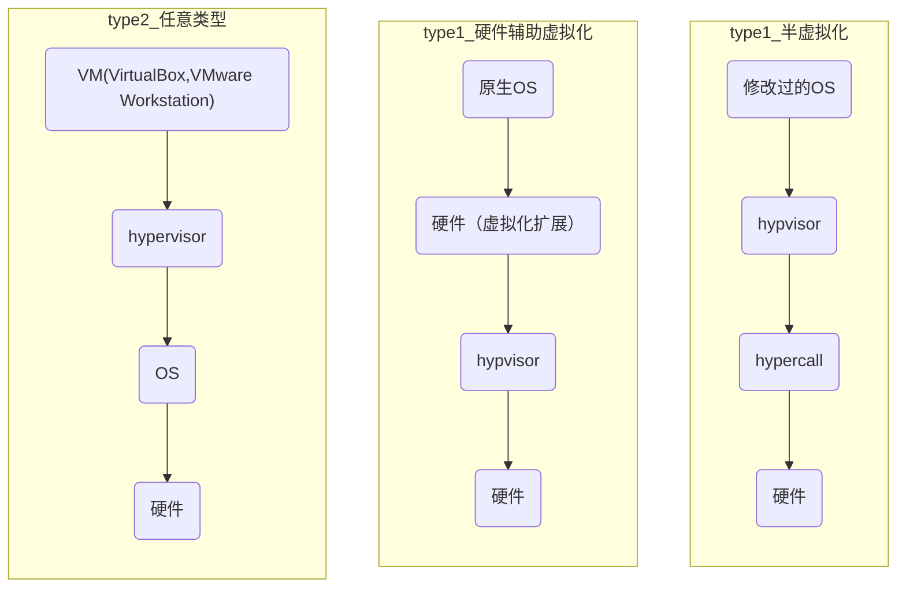

# readme

## 术语

- `VM` Virtual Machine
- `hypervisor`
- `内存虚拟化`
  - `GVA` Guest Virtual Address 虚拟机虚拟地址
  - `GPA` Guest Physical Address 虚拟机物理地址
  - `HVA` Host Virtual Address 宿主机虚拟地址
  - `HPA` Host Physical Address 宿主机物理地址

## hypervisor和虚拟化

hypervisor分为 `type-1` 和 `type-2`，而每种不同的类型又可以基于不同的技术来实现：**半虚拟化**或者**硬件虚拟化**。

| 组合类型              | 完整交互路径                                 | 核心特点                   |
|-------------------|----------------------------------------|------------------------|
| Type-1 + 半虚拟化	    | 修改过的 OS → hypercall → Hypervisor → 硬件	 | VM 改内核，Hypervisor 直连硬件 |
| Type-1 + 硬件辅助虚拟化	 | 原生 OS → 硬件（虚拟化扩展）→ Hypervisor → 硬件	    | VM 不改，靠硬件拦截指令          |
| Type-2（无论哪种技术）	   | VM → Type-2 Hypervisor → 宿主机 OS → 硬件	  | Hypervisor 依赖宿主机转发     |



## 半虚拟化和硬件辅助虚拟化

半虚拟化和硬件辅助虚拟化是两种实现虚拟化的核心技术手段，核心区别在于是否依赖硬件扩展、是否需要修改虚拟机操作系统（OS），最终目的都是让多个虚拟机高效共享物理资源并保持隔离。

- 半虚拟化不依赖硬件虚拟化扩展，通过修改虚拟机 OS 内核，让 VM 主动 “配合” Hypervisor 工作，避免直接执行敏感指令，从而实现虚拟化。
  - 虚拟机 OS 内核被改造（如添加hypercall“超级调用” 接口），当 VM 需要访问硬件（如读写磁盘、分配内存）时，不再发物理硬件指令，而是通过hypercall向 Hypervisor “申请服务”；
  - Hypervisor 收到请求后，统一调度物理资源，完成操作后将结果返回给 VM，全程无需拦截指令（因 VM 已主动 “报备”）。
- 硬件辅助虚拟化依赖 CPU 等硬件提供的虚拟化扩展指令集（如 Intel VT-x、AMD-V、RISC-V H 扩展），让 Hypervisor 能直接拦截 VM 的敏感指令，VM OS 无需修改即可运行。
  - 硬件为 Hypervisor 提供 “特权级隔离”（如 x86 的 “Root 模式” 和 VM 的 “非 Root 模式”），Hypervisor 运行在 Root 模式，拥有最高权限；
  - VM 运行在非 Root 模式，执行敏感指令（如修改 CPU 寄存器、访问物理内存）时，硬件会自动 “拦截” 并交给 Hypervisor 处理；
  - Hypervisor 处理后返回结果给 VM，VM 完全察觉不到硬件拦截，误以为自己独占物理机。

## hypervisor

Hypervisor（虚拟机监控器）是虚拟化技术的核心组件，它是一种运行在物理硬件之上的软件（或固件），负责创建、管理和隔离多个虚拟机（VM），并协调虚拟机对物理资源（CPU、内存、I/O 设备等）的访问。简单来说，Hypervisor 是 “虚拟机的操作系统”，它让多个虚拟机能够 “共享” 同一台物理机，同时彼此隔离、互不干扰。

而我们的hypervisor分为两种：`type-1` 和 `type-2`，他们的区别也非常明显，type-1 直接和硬件交互，而 type-2 则和宿主操作系统交互，通过宿主操作系统来操作硬件。

- type-1
  - 不提供传统 OS 的用户交互（如桌面、软件安装），但具备 OS 最核心的硬件驱动和资源调度能力；
  - 虚拟机（VM）能直接 “感知” 到由它提供的 “虚拟硬件”（如虚拟 CPU、网卡），因此 VM 里安装的操作系统（如 Windows、Linux）会误以为自己运行在独立物理机上，无需修改（除非是半虚拟化场景）。
- type-2
  - 它本身是宿主 OS（如 Windows）上的一个 “应用程序”（类似 VirtualBox.exe），所有对物理资源的操作（如给 VM 分配内存、转发网络数据）都要先经过宿主 OS 批准；
  - 虚拟机的资源性能会受宿主 OS 影响（比如宿主 OS 占用大量 CPU 时，VM 的 CPU 性能会下降），但胜在安装简单（直接在 Windows 上双击安装 VirtualBox 即可用），适合个人测试场景。

此外，大部分现代CPU都提供了对虚拟化的支持，例如intel的VM-x，amd的AMD-V，RISC-V的RISC-V的H扩展。对于type-1 hypervisor来说，他们需要根据硬件架构来适配对应的指令集。

而对于type-2型的hypervisor则无需直接调用这些指令集，他们是通过宿主操作系统的API来实现的资源虚拟化。

## 敏感指令和特权指令

- `特权指令` 是只有操作系统能执行的指令，例如访问寄存器，修改页表，访问物理内存等；
- `敏感指令` 是会影响虚拟机的隔离性的指令，例如查询CPU型号，查询物理内存大小等；

>特权指令是操作系统级的 “权限边界”：

本质是 “用户态程序不能碰，只有操作系统内核（或最高特权级软件）才能执行” 的指令，目的是保护物理机自身的资源和状态（如寄存器、物理内存、I/O 设备），防止用户程序滥用硬件。例如：修改 CPU 特权级寄存器、直接操作磁盘控制器端口，这些指令在物理机上只能由内核执行，用户态执行会触发异常。

>敏感指令是虚拟化场景下的 “隔离边界”：

本质是 “虚拟机不能直接执行，否则会破坏‘虚拟机以为自己独占硬件’的虚拟性” 的指令，无论其本身是否为特权指令。这些指令的执行结果若直接反映物理机状态（如 CPU 型号、物理内存总量），会让虚拟机察觉到自己运行在虚拟化环境中，或干扰其他虚拟机。例如：虚拟机查询物理内存大小（应返回虚拟分配的内存量而非真实物理内存）、读取物理 CPU 序列号（应返回虚拟 CPU 标识），这些指令需要被 Hypervisor 拦截并 “造假”，才能维持虚拟环境的隔离性。

## 思考题

>什么是SISD和SIMD指令？

- `SISD` 的全称是 Single Instruction Single Data，是每条指令接收一个输入，并产出一个结果；
- `SIMD` 的全称是 Single Instruction Multiple Data，是将多个输入打包进入一个更大的通道中，同时计算并返回多个结果。

例如，假设我们要执行一个加法，假设是32位的机器，并且寄存器也是32位，而我们的SIMD的通道是128位。

那么，在实际执行过程中，如果使用SISD指令，我们需要执行四条指令；

```asm
add x0, x0, x1
add x2, x3, x3
add x4, x4, x5
add x6, x6, x7
```

而对于SIMD，我们有128位，所以我们会将这八个输入，分为两组，每组是四个数字，加载到一个通道中。最后的结果可能是如下所示

```asm
vadd.vv v0, v1, v2
```

其中 v1 包含了四个 x0, x3, x4, x6，而 v2 包含了四个数字 x1, x3, x5, x7。