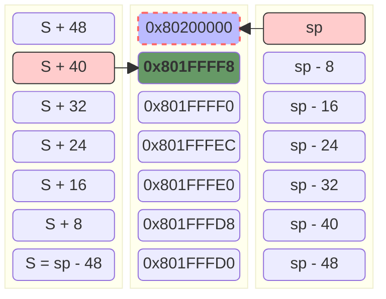

# readme

## example4-1

### asm

```asm
	.section .rodata
	.align   3
.string:
.string "data:
	%d       %d %d %d %d %d %d %d %d %d\n"

data:
	.word    1, 2, 3, 4, 5, 6, 7, 8, 9, -1

	.text
	.align   2

	.global  main
main:
	addi     sp,sp,-48                     # 栈往下扩展48字节
	sd       ra,40(sp)					   # 将return address存放在栈中，最终写入地址 = 新 sp + 40 = (S - 49) + 40 = S - 8。

	la       a0, .string                   # a0传递第一个参数：.string字符串
	li       a1,1                          # a1-a7 传递printf()前7个参数
	li       a2,2
	li       a3,3
	li       a4,4
	li       a5,5
	li       a6,6
	li       a7,7

	li       t0,8                          # printf()第8-10个参数通过栈来传递，由于sd的参数只能是寄存器，所以我们需要使用临时寄存器t0来辅助
	sd       t0,0(sp)
	li       t0,9
	sd       t0,8(sp)
	li       t0,-1
	sd       t0,16(sp)

	call     printf                        # 调printf()函数

	ld       ra,40(sp)                     # 从栈中恢复ra返回地址
	li       a0,0                          # 设置main函数返回值为0
	addi     sp,sp,48                      # SP回到原点

	ret
```

### stack

