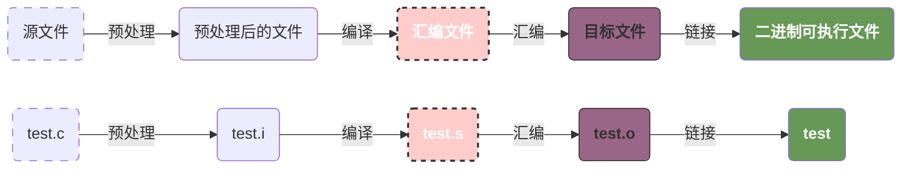
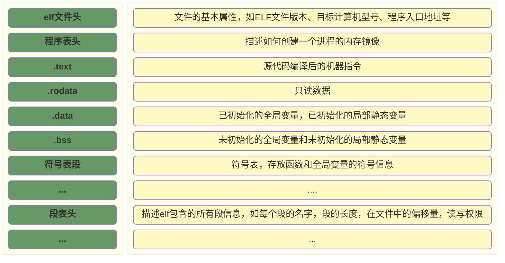

# readme.md

## 思考题

### 什么是汇编器

我们的汇编代码，并非可以实际执行的机器码（出于可读性的考虑），例如：

1. 代码包含了一些伪指令；例如RSIC-V中的 `call` 指令；
2. 代码中包含了一些标签，而在实际的机器码中，机器必须知道真实的地址；例如 `jal .Loop` 中 `.Loop` 会是一个真实的地址；
3. 代码并非实际的机器码；例如，假设存在一个机器，0 对应 add，1 对应 sub。那么在实际的机器码中，也必须将这两个指令转换为实际的机器码。

### 如何给汇编代码添加注释

通过 `#` 或者 `/*  */`

### 什么是符号

符号一般用于汇编内部的跳转，分为内部符号和全局符号。内部符号不会被链接到其他的地方。

### 什么是伪指令

伪指令是以 `.` 开头的指令，通常只是为了方便用户阅读代码，实际RISCV并不提供对应的机器指令。

### 在RISC-V汇编语言中，​“.align 3”表示什么意思

表示按照8字节对齐。

### .section

>下面这条使用了伪指令的语句表示什么意思？

```asm
.section ".my.text","awx"
```

### 在汇编宏里，如何使用参数

### 宏实例

>在汇编宏里，如何使用参数

```asm
.macro my_entry, rv, label
     j    rv\()\rv\()_\label
 .endm
```

>下面的语句调用my_entry宏，请解释该宏是如何展开的。

```asm
my_entry   1, irq  
```

### .SECTION和.PREVIOUS伪指令的作用

## 详情



### ELF



### elf header

```bash
# 读取头信息
readelf -h test
```

几个重要信息:

1. `Magic` 魔法数字，用于版本校验；
2. `Class` 指定elf类型；
3. `Entry point address` 程序入口地址；
4. `Section header` 段头的数量是27；
5. `Number of program headers` 程序头的数量是9。

```
ELF Header:
Magic:   7f 45 4c 46 02 01 01 00 00 00 00 00 00 00 00 00
Class:                             ELF64
Data:                              2's complement, little endian
Version:                           1 (current)
OS/ABI:                            UNIX - System V
ABI Version:                       0
Type:                              DYN (Position-Independent Executable file)
Machine:                           RISC-V
Version:                           0x1
Entry point address:               0x560
Start of program headers:          64 (bytes into file)
Start of section headers:          6688 (bytes into file)
Flags:                             0x5, RVC, double-float ABI
Size of this header:               64 (bytes)
Size of program headers:           56 (bytes)
Number of program headers:         9
Size of section headers:           64 (bytes)
Number of section headers:         27
Section header string table index: 26
```

### elf sections' header

```bash
readelf -S test
```

```
There are 27 section headers, starting at offset 0x1a20:
　
Section Headers:
[Nr] Name              Type              Address            Offset
     Size              EntSize           Flags  Link  Info  Align
　
[12] .text             PROGBITS          0000000000000560   00000560
     000000000000014a  0000000000000000  AX     0     0     4
[13] .rodata           PROGBITS          00000000000006b0   000006b0
     000000000000000c  0000000000000000   A     0     0     8
　
[21] .got              PROGBITS          0000000000002010   00001010
     0000000000000048  0000000000000008  WA     0     0     8
[22] .bss              NOBITS            0000000000002058   00001058
     0000000000000008  0000000000000000  WA     0     0     1
[24] .symtab           SYMTAB            0000000000000000   00001078
     0000000000000648  0000000000000018         25    45    8
Key to Flags:
W (write), A (alloc), X (execute), M (merge), S (strings), I (info),
L (link order), O (extra OS processing required), G (group), T (TLS),
C (compressed), x (unknown), o (OS specific), E (exclude),
D (mbind), p (processor specific)
```

## 5.2 一个简单的汇编程序

```asm
# 以“.”字符开始的指令是汇编器能识别的伪操作，它不会直接被翻译成机器指令，而由汇编器来进行预处理
	.section .data          # 指定.data段
	.align   3              # .align是对齐伪操作，参数为3，因此对齐的字节大小为23，即接下来的数据所在的起始地址能被8整除。
my_data1: # 分配一个初始值为100，大小为四个字节的内存块，并且绑定到标签 my_data
	.word    100
my_data2: # 分配一个初始值为50，大小为四个字节的内存块，并且绑定到标签 my_data
	.word    50
print_data: # 分配字符串
.string "data:
	%d\n"

	.section .text          # 切换到代码段
	.align   2              # 2^2字节对齐
	.global  main
main:
	addi     sp, sp, -16    # 初始化栈，保存调用信息
	sd       ra, 8(sp)

	lw       t0, my_data1   # 100 + 50
	lw       t1, my_data2
	add      a1, t0, t1

	la       a0, print_data # 调用printf
	call     printf

	li       a0, 0          # 设置返回值

	ld       ra, 8(sp)      # 恢复栈和调用信息
	addi     sp, sp, 16
	ret
```

### 对应的机器码

```bash
readelf -s test
```

```asm
Symbol table '.dynsym' contains 3 entries:
   Num:    Value          Size Type    Bind   Vis      Ndx Name
     0: 0000000000000000     0 NOTYPE  LOCAL  DEFAULT  UND 
     1: 0000000000012800     0 NOTYPE  GLOBAL DEFAULT  ABS __global_pointer$
     2: 00000000000102d0     0 FUNC    GLOBAL DEFAULT  UND printf@GLIBC_2.27 (2)

Symbol table '.symtab' contains 32 entries:
   Num:    Value          Size Type    Bind   Vis      Ndx Name
     0: 0000000000000000     0 NOTYPE  LOCAL  DEFAULT  UND 
     1: 0000000000010190     0 SECTION LOCAL  DEFAULT    1 .interp
     2: 00000000000101b8     0 SECTION LOCAL  DEFAULT    2 .hash
     3: 00000000000101d0     0 SECTION LOCAL  DEFAULT    3 .gnu.hash
     4: 00000000000101f8     0 SECTION LOCAL  DEFAULT    4 .dynsym
     5: 0000000000010240     0 SECTION LOCAL  DEFAULT    5 .dynstr
     6: 0000000000010270     0 SECTION LOCAL  DEFAULT    6 .gnu.version
     7: 0000000000010278     0 SECTION LOCAL  DEFAULT    7 .gnu.version_r
     8: 0000000000010298     0 SECTION LOCAL  DEFAULT    8 .rela.plt
     9: 00000000000102b0     0 SECTION LOCAL  DEFAULT    9 .plt
    10: 00000000000102e0     0 SECTION LOCAL  DEFAULT   10 .text
    11: 0000000000011e80     0 SECTION LOCAL  DEFAULT   11 .dynamic
    12: 0000000000012000     0 SECTION LOCAL  DEFAULT   12 .data
    13: 0000000000012018     0 SECTION LOCAL  DEFAULT   13 .got
    14: 0000000000000000     0 FILE    LOCAL  DEFAULT  ABS test.o
    15: 0000000000012000     0 NOTYPE  LOCAL  DEFAULT   12 my_data1
    16: 0000000000012004     0 NOTYPE  LOCAL  DEFAULT   12 my_data2
    17: 0000000000012008     0 NOTYPE  LOCAL  DEFAULT   12 print_data
    18: 0000000000000000     0 FILE    LOCAL  DEFAULT  ABS 
    19: 00000000000102b0     0 OBJECT  LOCAL  DEFAULT    9 _PROCEDURE_LINKA[...]
    20: 0000000000011e80     0 OBJECT  LOCAL  DEFAULT   11 _DYNAMIC
    21: 0000000000012030     0 OBJECT  LOCAL  DEFAULT   13 _GLOBAL_OFFSET_TABLE_
    22: 0000000000012038     0 NOTYPE  GLOBAL DEFAULT   13 __BSS_END__
    23: 0000000000012038     0 NOTYPE  GLOBAL DEFAULT   13 _edata
    24: 0000000000012038     0 NOTYPE  GLOBAL DEFAULT   13 __SDATA_BEGIN__
    25: 0000000000012000     0 NOTYPE  GLOBAL DEFAULT   12 __DATA_BEGIN__
    26: 0000000000012038     0 NOTYPE  GLOBAL DEFAULT   13 _end
    27: 0000000000000000     0 NOTYPE  GLOBAL DEFAULT  UND _start
    28: 0000000000012800     0 NOTYPE  GLOBAL DEFAULT  ABS __global_pointer$
    29: 0000000000012038     0 NOTYPE  GLOBAL DEFAULT   13 __bss_start
    30: 00000000000102e0     0 NOTYPE  GLOBAL DEFAULT   10 main
    31: 00000000000102d0     0 FUNC    GLOBAL DEFAULT  UND printf@GLIBC_2.27
```

## 5.3 汇编语法

>这里只记录一些重要的知识点

1. 全局符号通过 `.globa1` 声明；
2. 本地符号在elf中，通常通过 `.L` 定义本地符号，本地符号不会出现在符号表中；
3. 本地标签通常通过 0~99 的整数作为编号，和 `f` 或者 `b` 一起使用；其中 `f` 表示向前搜索，`b` 表示向后搜索；
4. 可以定义相同的标签，但是一般会被汇编器编译成更有意义的本地符号，例如：
   1. 第一个`1`可能会被编译成 `.L1C-B1`
   2. 第二个`1`可能会被编译成 `.L1C-B2`

## 5.4 伪指令

### 5.4.1 .align

.ALIGN伪指令用来对齐或者填充数据等。.ALIGN伪指令通常有3个参数。第一个参数表示对齐的要求。第二个参数表示要填充的值，可以省略，如果省略，填充的值通常为0。在大多数系统上，如果需要在代码段中填充第二个参数，则用NOP指令来填充。第三个参数表示对齐指令应该跳过的最大字节数。如果为了对齐需要跳过比指定的最大字节数更多的字节，则编译器不会执行对齐操作。通常只使用第一个参数。在RISC-V体系结构中，第一个参数表示2^n字节。

这里指的注意的是，基本所有的指令集都是对齐2^n字节。

### 5.4.3 数据定义伪指令

- `.BYTE`
- `.HWORD` 和 `.SHORT`，这里 HWORD == Half word
- `.LONG`, `.INT`, `.WORD`，LONG来自于早期x86的习惯，INT则是对应于C
- `.QUAD`
- `.FLOAT`
- `.ASCII` 和 `.STRING` 插入字符串，.ASCII需要自己在结尾声明 `\0`
- `.ASCIZ` 等同于 .ASCII，但是自动插入 `\0`
- `REPT` 和 `.ENDR` 重复执行伪指令
- `.EQU` 给符号赋值

#### REPT

```asm
.rept 3
.long 0
.endr
```

等同于

```asm
.long 0
.long 0
.long 0
```

#### .EQU

```asm
    .equ my_data1, 100  #为my_data1符号赋值100
    .equ my_data2, 50   #为my_data2符号赋值50
    .global main
main:
   ...
   li x2, = my_data1
   li x3, = my_data2
   add x1, x2, x3
   ...
```

### 5.4.3 函数相关的伪指令

- .global：定义一个全局的符号，可以是函数的符号，也可以是全局变量的符号。
- .include：引用头文件。
- .if, .else, .endif：控制语句。
- .ifdef symbol：判断symbol是否定义。
- .ifndef symbol：判断symbol是否没有定义。
- .ifc string1,string2：判断字符串string1和string2是否相同。
- .ifeq expression：判断expression的值是否为0。
- .ifeqs string1,string2：等同于.ifc。
- .ifge expression：判断expression的值是否大于或等于0。
- .ifle expression：判断expression的值是否小于或等于0。
- .ifne expression：判断expression的值是否不为0。

### 5.4.4 与段相关的伪指令

#### .section

```asm
.section name "flags"               # 表示后续的代码被链接到name，flags表示段的属性。
.section .fixup,"ax"                # 表示代码在.fixup段，并且具有可分配以及可执行属性
```

#### .pushsection && .popsection

- 2~5  代码会被链接到 .text
- 7~20 compare_and_return() 函数会被链接到 .my.text 段

```asm
1    .section .text
2    .global my_memcpy_test
3    my_memcpy_test:
4        ...
5        ret
6
7    .pushsection ".my.text", "awx"
8
9    .global compare_and_return
10   compare_and_return:
11       bltu  a0,a1,.L2
12       li  a5,0
13       j  .L3
14   .L2:
15       li  a5,-1
16   .L3:
17       mv  a0, a5
18       ret
19   
20   .popsection
21
22   ...
```

#### .section && .previous

- 在第1行中，声明一个.text.boot段。
- 在第13～17行中， 通过.SECTION和.PREVIOUS两条伪指令把这里面的汇编代码链接到.fixup段。
- 在第19～22行中，通过.SECTION和.PREVIOUS两条伪指令把这里面的汇编代码链接到.init_ boot段。
- 在第24行中，CALL指令恢复到.SECTION伪指令定义之前的那个段作为当前段，即.text.boot段。
- 所以，第6～11行以及第24行汇编代码会链接到.text.boot段，而第14～16行汇编代码链接到.fixup段，第20行和第21行汇编代码链接到.init_boot段。


```asm
1    .section ".text.boot"
2
3    .globl _start
4    _start:
5        /*关闭中断*/
6        csrw sie, zero
7
8        /*设置栈, 栈的大小为4KB*/
9        la sp, stacks_start
10       li t0, 4096
11       add sp, sp, t0
12
13       .section .fixup, "ax"
14       .balign 4
15       li a2, -1
16       li a1, 0
17       .previous
18
19       .section .init_boot,"ax"
20       li a0, -1
21       mv a1, a2
22       .previous
23
24       call kernel_main
```

### 5.4.5 与宏相关的伪指令

#### 宏参数的使用

```asm
# 使用参数
.macro add_1 p1 p2
add x0,   \p1, \p2
.endm

# 宏可以使用默认值
.macro reserve_str p1=0 p2
```

##### 5-11

```asm
# 这个宏设置了p1=0，设置a5和a6两个寄存器，最后增加两个寄存器存入到a1
1    .macro add_data p1=0 p2
2    mv a5, \p1
3    mv a6, \p2
4    add a1, a5, a6
5    .endm
6
7    .globl main
8    main:
9        mv a2, #3
10       mv a3, #3
11
12       add_data a2, a3
# 这里使用默认值 p1=0
13       add_data , a3
```

##### 5-12

```asm
# 在宏参数后面加“:req”表示在宏调用过程中必须传递一个值，否则编译时会报错
1   .macro add_data_1 p1:req p2
2   mv a5, \p1
3   mv a6, \p2
4   add a1, a5, a6
5   .endm
6
7   .globl main
8   main:
# 这里必须传值，所以会抛出异常
9       add_data_1 , a3
```

#### 宏的特殊字符

可以使用“\()”来告知汇编器，宏的参数什么时候结束。例如，下面的代码片段中， \base后面加了“\()”​，因此汇编器就知道字母e为参数的最后一个字符。

```asm
# opcode base 1 会被连接伪 base.1
.macro opcode base length
\base\().\length
.endm

# my_entry 1 irq 得到 
# j rv1_irq
.macro my_entry, rv, label
     j    rv\()\rv\()_\label
 .endm
```

### 5.4.6 与文件相关的伪指令

.INCBIN伪指令可以把文件的二进制数据嵌入当前位置。

```asm
  .section .payload, "ax", %progbits
  .globl payload_bin
payload_bin:
  .incbin  "benos.bin"
```
