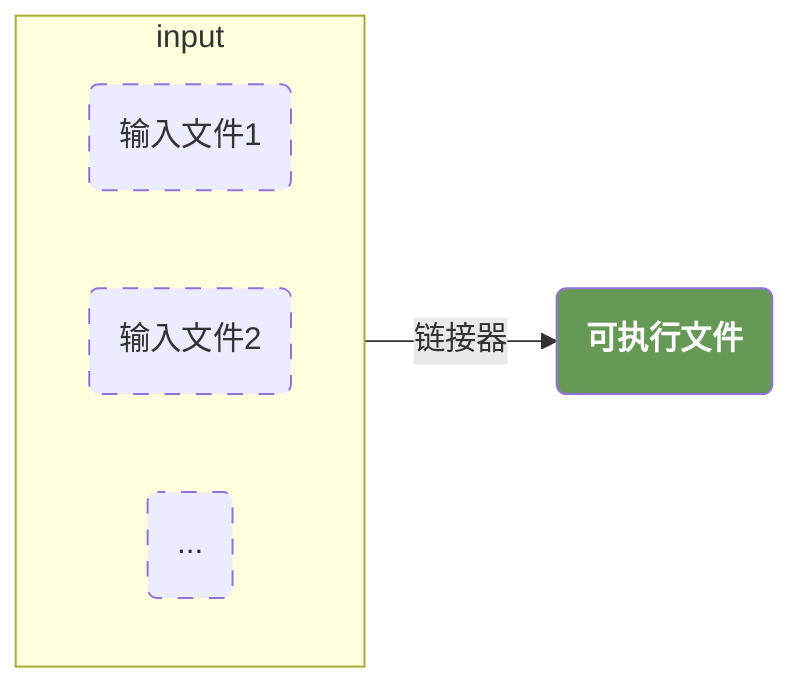

# 链接器

## 6.2 链接脚本

### 6.2.1 一个简单的链接程序

在下面的链接脚本中，功能如下：

1. 指定输出文件的代码段从地址 `0x80200000` 开始，并且由所有输入文件的代码段共同组成；
2. 指定输出文件的数据段从地址 `0x80210000` 开始，并且由所有输入文件的数据段共同组成；
3. 指定输出文件的未初始化段，紧跟输出文件中的数据段的结束地址，并且由所有输入文件的未初始化段共同组成。

```asm
SECTIONS                        # 描述输出文件的内存布局，告诉链接脚本如何把输入文件的段映射到输出文件的各个段
{
    . = 0x80200000              # . 代表当前位置计数器，设置当前地址
    .text : { *(.text) }        # 指定输出文件的代码段由所有输入文件的代码段组成
    . = 0x80210000              # 修改当前地址
    .data : { *(.data) }        # 指定输出文件的数据段由所有输入文件的代码段组成
    .bss  : { *(.bss) }         # 指定输出文件的未初始化段由所有输入文件的未初始化段组成
}
```

#### SECTIONS命令的格式

```asm
SECTIONS
{
sections-command
sections-command
...
}
```

sections-command 包含了：

1. `ENTRY` 用于设置程序的入口；
2. 符号赋值语句，用于给符号赋值；
3. 输出段的描述语句。

### 6.2.2 设置入口点

程序的入口点，就是可执行程序被执行时，执行的第一条指令的地址。

例如，我们默认情况下，入口是main函数，但是我们也可以通过 ENTRY(label) 来修改入口函数。

此外，如果我们使用C语言，C的标准库会为我们提供一个默认的 `_start` 作为启动函数，程序会先执行 `_start`，随后跳转到 `main` 函数中。

如果我们通过 `ENTRY(my_main)` 来指定入口，则操作系统会从 `my_main` 作为启动函数。

### 6.2.3 基本概念



“可加载” 表示该段的内容需要从可执行文件（如 ELF）中读取并加载到内存中，“可分配” 表示该段在程序运行时需要在内存中分配一块空间（即使该段在磁盘上没有实际数据）。

按照我的理解来说，可加载更倾向于在源码中已经确定的信息，例如代码和初始化好的变量。而可分配更倾向于在运行时才知道的信息，例如堆和栈。

此外，有一个比较特殊的例子就是 `.bss` 段。它属于 “可分配”，但内容（全 0）是编译时就确定的，大小也是源码中变量定义决定的（如 static int b; 占 4 字节），并非 “运行时才知道”。但它依然归为 “可分配” 而非 “可加载”，因为它在可执行文件中不存储实际数据（只记录大小），加载时只需分配内存并自动清零，无需从文件中 “加载” 数据 —— 这是它和 .data 段（需加载非零数据）的核心区别。

这也是为什么初始化为0的静态变量和初始化为非0的静态变量是分别存放在 `.bss` 和 `.data` 中的。

### 6.2.4 符号赋值与引用

在链接脚本中，并没有分配内存来存储这个符号，**而是存储地址**。例如，`foo = 0x100;` 在链接器中表示 `foo` 这个符号指向了 `0x100` 这个地址。

```asm
start_of_ROM = .ROM;
end_of_ROM = .ROM + sizeof (.ROM);
start_of_FLASH = .FLASH
```

可以通过如下C语言访问：

```c
extern char start_of_ROM, end_of_ROM, start_of_FLASH;
memcpy (&start_of_FLASH,&start_of_ROM,&end_of_ROM -&start_of_ROM);
```

>为什么使用 `char` 来访问链接脚本中的变量？

1. char 类型的本质：1 字节的 “内存单元”
2. memcpy 函数的参数要求：void* 与字节级复制
3. 符号的本质：地址而非变量
4. 其他类型，例如 int 修改会按照4字节修改。

>`&start_of_ROM` 这里是值还是地址？

```asm
# asm
start_of_ROM = 0x1000;

# c
extern char start_of_ROM;
# &start_of_ROM -> 0x1000
```

在 C 语言中，&start_of_ROM 表示 “start_of_ROM 这个变量的地址”。但由于 start_of_ROM 是链接脚本定义的符号（而非真正的变量）：
1. 编译器会将 start_of_ROM 的 “值”（0x1000）直接作为它的 “地址”。
2. 因此，&start_of_ROM 的值就是 start_of_ROM 本身的值（0x1000）。

#### 6-4

```asm
SECTIONS
{
  start_of_text = . ;       # 记录代码段的开始地址
  .text: { *(.text) }
  end_of_text = . ;         # 记录代码段的结束地址
　
  start_of_data = . ;
  .data: { *(.data) }
  end_of_data = . ;
}
```

可以这样访问：

```c
extern char start_of_text[];
extern char end_of_text[];
extern char start_of_data[];
extern char end_of_data[];
```

>在链接脚本中，其实并没有所谓类型的概念。所以我们可以把数据当做一个连续的内存块来处理。
>例如，假设一个数字由四个字节分别是1，2，3，4四个字节组成。那我们也可以完全当做四个字节来处理

### 6.2.5 当前位置计数器

```asm
1     floating_point = 0;               # 定义一个符号 floating_point 并赋值为 0。这通常用于标记 “是否使用浮点运算”（0 表示不使用）
2     SECTIONS
3     {
4         .text :
5         {
6         *(.text)
7         _etext = .;                   # 定义符号 _etext，记录 .text 段的结束地址（当前位置计数器）
8         }
          # 原理：(. + 3) & ~3 是一种经典的向上对齐算法：
          # . 是当前位置计数器（.text 段结束后的地址，即 _etext 的值）。
          # (. + 3)：先将当前地址加 3，确保任何非 4 倍数的地址都能 “进位” 到下一个 4 倍数区间。
          # & ~3：~3 是二进制 ...11111100，与上一步结果按位与，会清除最后 2 位，得到距离当前地址最近的4 字节倍数地址（即 4 字节对齐）。
9         _bdata = (. + 3) & ～3;       # 设置_bdata的起始地址为当前位置后下一个与4字节对齐的地方
10        .data : { *(.data) }
11    }
```

### 6.2.6 SECTIONS命令

#### 实例6-6

```asm
1     SECTIONS {
2         outputa 0x10000 :         # 声明 outputa 段，地址在 0x10000
3         {
4             all.o                 # 加入 all.o 的全部段
5             foo.o (.input1)       # 加入 foo.o 的 .input1 段
6         }
7         outputb :                 # 声明 outputb 段
8         {
9             foo.o (.input2)       # 加入 foo.o 的 .input2 段
10            foo1.o (.input1)      # 加入 foo1.o 的 .input1 段
11        }
12        outputc :                 # 声明 outputc 段
13        {
14            *(.input1)            # 加入所有文件的 .input1 段
15            *(.input2)            # 加入所有文件的 .input2 段
16        }
17    }
```

#### 实例6-7

>注意，这里的 `AT ( ADDR (.text) + SIZEOF (.text) )` 这个代码，表示可执行文件中的地址和实际运行时的地址会不一样。
>他的运行时地址通过 `.mdata 0x2000` 来执行，但是他在可执行文件中的LMA是紧跟在 .text 段之后。

```asm
SECTIONS
{
    # .text段位置为0x1000，包含全部文件的.text段，同时在 _etext 中记录了.text段的结束地址
    .text 0x1000 : { *(.text) _etext = . ; }

    # VMA（运行时地址） 为 0x2000（程序运行时，.data 数据实际存放的地址）。
    .mdata 0x2000 :
        # LMA（加载地址） 通过 AT(ADDR(.text) + SIZEOF(.text)) 指定，
        # 即 .text 段结束后的地址（.text 加载地址 + 大小）。
        # 这意味着 .data 数据在可执行文件中会紧跟 .text 段存放，但程序运行时会被复制到 0x2000 处。
        # 包含所有输入文件的 .data 段（已初始化非零数据），并用 _data、_edata 记录其 VMA 的起始和结束地址。
        AT ( ADDR (.text) + SIZEOF (.text) )
    # _data 记录了 .mdata 的开始地址
    # 同时 .mdata 包含了全部文件的 .data 字段
    # _edata 记录了 .mdata 的结束地址
        { _data = . ; *(.data); _edata = . ;  }

    # .bss段在 0x3000
    .bss 0x3000 :
        { _bstart = . ;  *(.bss) *(COMMON) ; _bend = . ;}
}
```

### 6.2.7 

#### ABSOLUTE

```asm
SECTIONS
{
   . = 0xb0000,
   .my_offset : {
        my_offset1 = ABSOLUTE(0x100);       # my_offset1 = 0x100
        my_offset2 = (0x100);               # my_offset2 = 0xb000 + 0x100
   }
}
```

#### ALIGN

```asm
SECTIONS { 
   ...
   .data ALIGN(0x2000): {           # 下一个与 0x2000 对齐的地址，也就是8192字节
   *(.data)
   variable = ALIGN(0x8000);
   }
   ... 
}
```

## 6.4 链接重定位与连接器松弛优化

在编译阶段，编译器无法确定每个符号的最终位置，所以在编译阶段所有的符号的地址都暂时设定为 `0x0`，只有在最终的链接阶段才能确定具体的位置。

注意，这里的 `0x0` 是一种简化的表达，实际上是，代码的初始地址为`0`，标签的地址是**相对于这个初始地址的偏移量**

### 6.4.1 链接重定位

```c
int a = 5;
　
int foo(void)
{
 return a;
}
　
int main(void)
{
  foo();
}
```

编译我们的代码

```bash
# -mno-relax 表示关闭松弛优化
riscv64-linux-gnu-gcc test.c -o test --save-temps -mno-relax
```

得到

```asm
1    a:
2        .word  5           # int a = 5
3        .text
4        
5    foo:
6        ...
7        lla  a5, a
8        lw  a5,0(a5)
9        ...
10
11   main:
12       ...
13       call  foo
14       ...
```

使用 `riscv64-linux-gnu-objdump` 命令查看汇编后的代码

```bash
riscv_example$ riscv64-linux-gnu-objdump -d  -r test.o
```

>在下面的代码中，在编译期，foo函数并不知道全局变量a的位置；main也并不知道函数foo的位置。
>但是，我们的代码中类似于 `auipc a5, 0x0` 是怎么知道自己需要重定位的呢？
>这里就涉及到elf文件格式的 `重定位表（relocation table）`，他保存了目标文件需要重定位的信息。

```asm
Disassembly of section .text:
　
0000000000000000 <foo>:                  # 前面提到的，在编译期初始地址为 0x0
 0: 1141              addi sp,sp,-16
 2: e422              sd   s0,8(sp)
 4: 0800              addi s0,sp,16
   6: 00000797          auipc    a5,0x0   # 此处需要重定位
          6: R_RISCV_PCREL_HI20  a        # 这里是对应的重定位信息，在重定位表也可以查得到
   a: 00078793          mv   a5,a5
          a: R_RISCV_PCREL_LO12_I  .L0    # 此处需要重定位
 e: 439c              lw   a5,0(a5)
10: 853e              mv   a0,a5
12: 6422              ld   s0,8(sp)
14: 0141              addi sp,sp,16
16: 8082              ret
　
0000000000000018 <main>:
18: 1141              addi sp,sp,-16
1a: e406              sd   ra,8(sp)
1c: e022              sd   s0,0(sp)
1e: 0800              addi s0,sp,16
  20: 00000097          auipc    ra,0x0   # 此处需要重定位
        20: R_RISCV_CALL  foo
  24: 000080e7          jalr ra # 20 <main+0x8>
28: 4781              li   a5,0
2a: 853e              mv   a0,a5
2c: 60a2              ld   ra,8(sp)
2e: 6402              ld   s0,0(sp)
30: 0141              addi sp,sp,16
32: 8082              ret
```

```
rlk@master:riscv_example$ riscv64-linux-gnu-objdump -r test.o
　
test.o:    file format elf64-littleriscv
　
RELOCATION RECORDS FOR [.text]:
OFFSET           TYPE                 VALUE
0000000000000006 R_RISCV_PCREL_HI20    a
000000000000000a R_RISCV_PCREL_LO12_I  .L0
0000000000000020 R_RISCV_CALL          foo
```

### 6.4.2 函数跳转优化

`CALL` 指令是一个伪指令，实际上可能是：

```asm
auipc ra, 0
jalr  ra, ra, 0
```

但是在真正确定地址的时候，如果短跳转指令可以满足需求，那么他会被合并为单条指令

```asm
jal offset
```

### 6.4.3 符号地址访问优化

RISC-V在访问32位PC相对地址或者符号（如全局变量）时常常使用如下两条指令的组合

```asm
auipc a0, %pcrel_hi(sym)
addi  a0, a0, %pcrel_lo (sym)
```

下面的C代码

```c
long a = 5;
long b = 10;
　
long data(void) {
  return a | b;
}
　
void kernel_main(void)
{
  ...
  data();
　
  while(1)
      ;
}
```

编译之后的到

```asm
Disassembly of section .text:
　
0000000000000000 <data>:
 0: 00000797         auipc  a5,0x0          # 等待链接器优化
        0: R_RISCV_PCREL_HI20  a
        0: R_RISCV_RELAX  *ABS*
 4: 00078793         mv  a5,a5              # 这里其实是 addi a5, a5, 0，也需要等待链接器生成地址
        4: R_RISCV_PCREL_LO12_I  .L0
        4: R_RISCV_RELAX  *ABS*
 8: 6398             ld  a4,0(a5)
   a: 00000797         auipc  a5,0x0
        a: R_RISCV_PCREL_HI20  b
        a: R_RISCV_RELAX  *ABS*
 e: 00078793         mv  a5,a5
        e: R_RISCV_PCREL_LO12_I  .L0
        e: R_RISCV_RELAX  *ABS*
12: 639c             ld  a5,0(a5)
14: 8fd9             or  a5,a5,a4
16: 853e             mv  a0,a5
18: 8082             ret
```