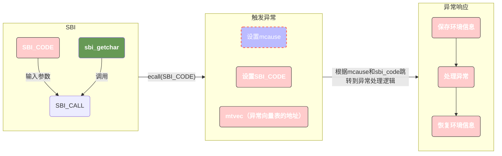

# readme

在MySBI固件中实现SBI_CONSOLE_GETCHAR的服务接口并测试。

## 描述

一次标准的SBI调用流程如下：

1. 准备 SBI 调用参数：
   1. 将 “SBI 控制台获取字符” 的调用号 0x02 存入 a7 寄存器（这是 SBI 规范约定的功能标识，对应 SBI_CONSOLE_GETCHAR）；
   2. 该功能无需输入参数，因此 a0-a2 寄存器均设为 0（符合宏 SBI_CALL_1(which, arg0) 中 arg0=0、其余参数默认 0 的设计）。
2. 执行 ecall 指令触发异常：
   1. S 模式下执行 ecall 后，CPU 自动完成以下硬件操作：
      1. 将 mcause 寄存器设为 0x9（标识 “来自 S 模式的环境调用” 异常）；
      2. 将当前执行地址（ecall 下一条指令的地址）存入 mepc 寄存器，用于后续返回；
      3. 根据 mtvec 寄存器（M 模式异常向量表基地址）跳转到 M 模式的异常处理入口（通常是 OpenSBI 固件的处理逻辑）。
3. OpenSBI 固件处理调用：
   1. 固件的异常处理程序读取 mcause=0x9，确认是 S 模式发起的 ecall；
   2. 读取 a7=0x02，识别出需要执行 “控制台获取字符” 功能；
   3. 执行具体的硬件交互逻辑（如从 UART 控制器读取一个输入字符）；
   4. 将读取到的字符（以 unsigned char 转换为 unsigned long 类型）存入 a0 寄存器，作为返回值。
4. 返回 S 模式并恢复执行：
   1. 固件通过 mret 指令返回 S 模式，CPU 自动从 mepc 恢复执行地址；
   2. S 模式代码从 a0 寄存器获取返回的字符，完成 sbi_getchar() 函数的逻辑（返回该字符）。

整个流程的核心是：通过 a7 传递具体功能编号，ecall 触发硬件自动设置异常类型（mcause），固件根据两者协作完成服务并返回结果，体现了 RISC-V 特权级交互中 “软件约定 + 硬件机制” 结合的设计思路。

这里比较容易混淆的是两个参数：

1. SBI调用号；
2. mcause的值；

其中SBI调用号表示的是ecall下具体的功能编号，而mcause则是指代的ecall这个异常。

1. 硬件通过 mcause 先 “定性”—— 确认这是一次 ecall 异常，并且能区分是哪个特权级发起的（比如 mcause=0x9 就知道是 S 模式发起的 ecall），相当于先划定 “异常类别”。
2. 软件通过 SBI 调用号再 “定量”—— 在 “ S 模式 ecall ” 这个类别里，通过 a7 里的调用号（比如 0x02），明确具体要执行的功能（比如 “控制台获取字符”）。

