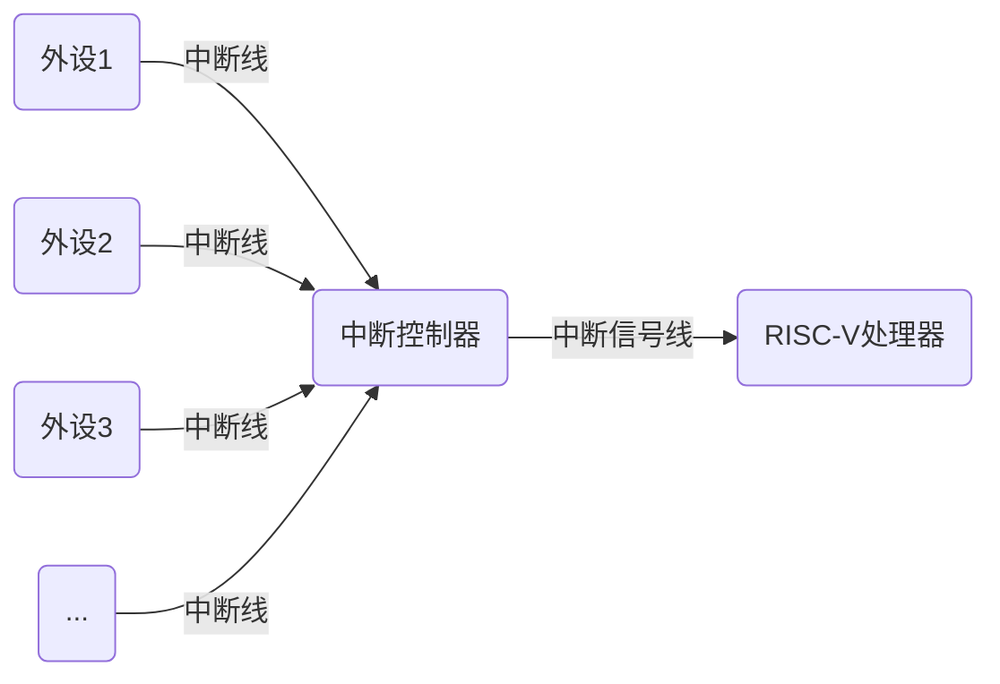
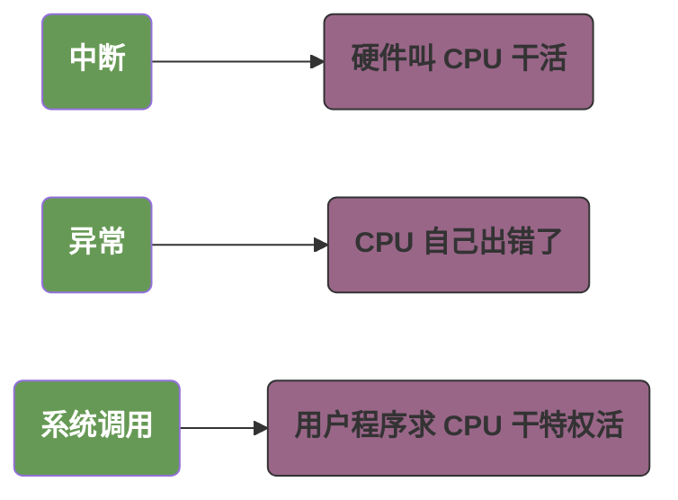
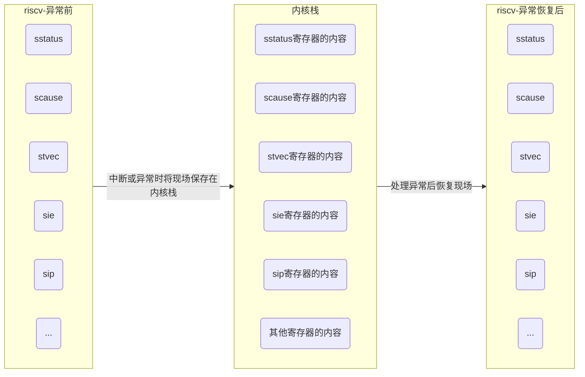

# 异常处理

## 思考题

### 在RISC-V处理器中，异常有哪几种？

### 同步异常和异步异常有什么区别？

### 在RISC-V处理器中，异常发生时CPU自动做了哪些事情？操作系统需要做哪些事情？

### 返回时，异常是返回到发生异常的指令还是下一条指令？

### 返回时，异常如何选择处理器的执行状态？

### 请简述RISC-V体系结构的异常向量表。

### 异常发生后，软件需要保存异常上下文，异常上下文包括哪些内容？

### 异常发生后，软件如何知道异常类型？

## 8.1 异常处理基本概念



>`中断`，`异常`，`系统调用` 本质上都属于异常事件。
>简单来说：中断是 “硬件叫 CPU 干活”，异常是 “CPU 自己出错了”，系统调用是 “用户程序求 CPU 干特权活”。



1. 中断（Interrupt）：处理 “外部异步事件”，让 CPU 暂停当前任务，优先响应外部硬件的紧急请求，处理完成后回到原任务继续执行，实现 “并发处理外部事件”。主要来自外部硬件设备（非 CPU 内部产生），如定时器、键盘、网卡、磁盘等。
   1. 典型场景有：
      1. 定时器中断：每隔固定时间触发（如 1ms），用于操作系统的任务调度（切换不同任务）；
      2. 键盘中断：用户按下键盘按键时触发，CPU 暂停当前程序，读取按键数据并处理（如显示字符）；
      3. 网卡中断：网卡接收到网络数据时触发，CPU 及时读取数据，避免数据丢失。
   2. 关键特征：
      1. 异步性：事件发生时间不确定（如用户随时按键盘），不依赖 CPU 执行的指令流；
      2. 可屏蔽性：部分中断（如外设中断）可通过寄存器暂时关闭（屏蔽），避免频繁打断关键任务。
2. 异常（Exception，狭义）：处理 “CPU 内部同步错误”。核心作用：当 CPU 执行指令时遇到 “非法操作” 或 “错误状态”，暂停当前执行流，进入异常处理程序修复错误或终止异常任务，保障系统稳定。
   1. 关键特征：
      1. 同步性：事件与当前执行的指令直接关联（如执行 div 指令时除数为 0，必然触发异常）；
      2. 不可屏蔽性：多数异常（如指令错误、内存越界）无法屏蔽，必须处理（否则程序会崩溃）。
   2. 典型场景：
      1. 指令异常：执行非法指令（如不存在的汇编指令）、指令格式错误；
      2. 内存异常：访问未授权内存（如用户程序访问内核地址）、内存地址对齐错误（如用 lw 读取奇数地址）；
      3. 算术异常：除法除数为 0、整数溢出（如 32 位整数相加超出最大值）。
3. 系统调用（System Call）：用户程序 “请求内核服务” 的接口。作为用户态程序与内核态的 “桥梁”，让用户程序安全地调用内核提供的特权操作（用户态无权限直接执行），实现 “受限的资源访问”。
   1. 关键特征：
      1. 主动性：由用户程序主动发起，是 “可控的异常”；
      2. 权限切换：触发后 CPU 从 “用户态” 切换到 “内核态”（内核拥有最高权限），执行完服务后切回用户态。
   2. 典型场景：
      1. 文件操作：用户程序需要读写文件（如 open/read/write），需通过系统调用让内核操作磁盘；
      2. 内存分配：用户程序调用 malloc 时，底层通过系统调用（如 brk 或 mmap）向内核申请内存；
      3. 进程管理：用户程序创建子进程（如 fork）、等待进程结束（如 wait），需内核调度和管理进程资源。


### 8.1.3　异常触发与返回的流程


### 8.1.4 异常返回地址

在发生异常时，发生异常的PC地址会被存放在 `mepc/spec` 寄存器中，并且使用 `mret/sret` 回复寄存器。

在异常处理恢复之后，我们执行的下一行代码也是根据异常的类型不一样结果不一样的。

1. 对于中断，我们回到因为中断导致未能正常执行的第一条指令。因为中断是来自程序外部的；
2. 对于异常，我们回到触发异常的指令，因为异常通常是因为程序自身的指令导致的，并且这条指令通常是失败了的；
3. 对于系统调用，我们回到系统调用的后一条指令，因为系统调用一般是程序自身的行为，并且通常是成功的。

## 8.2 与M模式相关的异常寄存器

先必须要了解到我们的几个重要的工具：

- `mcause` Machine Cause Register，明确异常的具体类型（如中断、指令错误、系统调用等），帮助处理程序判断异常来源。
- `mtval` Machine Trap Value，记录异常相关细节。例如：内存访问异常（如越界、对齐错误），指令异常（如非法指令、未定义指令），其他异常（如系统调用、中断）。
- `mtvec` Machine Trap Vector Base Address Register，异常处理程序的入口地址寄存器，用于指定当 M 模式发生异常（包括中断、同步异常、系统调用等）时，CPU 应该跳转到哪个地址执行处理逻辑。它是指向异常向量表的寄存器（Exception Vector Table） 可以认为，为每一个异常都绑定了一个回调函数，当异常触发时，根据对应的异常，使用 mcause，mtval，mepc 等信息来处理业务逻辑。
- `mepc` Machine Exception Program Counter，保存异常发生时正在执行的指令地址，用于异常处理完成后恢复执行。
- `mstatus` Machine Status Register，是管理系统状态和异常行为的核心寄存器，用于记录和控制 CPU 的运行状态（如中断使能、特权模式切换、异常嵌套等），是异常处理和模式切换的 “总开关”。
- `mie` Machine Interrupt Enable Register，控制 M 模式下哪些类型的中断可以被响应（全局及各类中断的开关）。
- `mip` Machine Interrupt Pending Register，指示当前哪些类型的中断已触发但尚未处理
- `mideleg` Machine Interrupt DELEGation Register，将M模式的部分中断委托给S模式
- `medeleg` Machine Exception DELEGation Register，将M模式的部分异常委托给S模式

>1. `mcause` 表示异常的类型，`mtval` 表示该异常类型的补充。例如，假设 `mcause` 是内存访问异常，`mtval` 表示的可能就是访问的内存的地址。

## 8.3 与S模式相关的异常寄存器

- `sstatus` Supervisor Status Register，记录和控制 S 模式的运行状态，包括中断使能、特权模式切换、异常相关标志等，是 S 模式的 “状态控制面板”。
- `sie` Supervisor Interrupt Enable Register
- `sip` Supervisor Interrupt Pending Register
- `scause` Supervisor Cause Register
- `stvec` Supervisor Trap Vector Base Address Register

## 8.4 异常上下文

寄存器可以使用一个结构体来表示：

在机器运行的过程中，和机器连接最紧密的是操作系统的内核。而程序是运行在内核上，通过操作系统内核和硬件交互的。

而内核和普通的程序一样，有自己的堆和栈。当出现异常时，这个结构体是被存储在内核栈上的。

```c
struct pt_regs {
  /*31个通用寄存器 + sepc + sstatus */
  unsigned long sepc;
  unsigned long ra;
  unsigned long sp;
  unsigned long gp;
  unsigned long tp;
  unsigned long t0;
  unsigned long t1;
  unsigned long t2;
  unsigned long s0;
  unsigned long s1;
  unsigned long a0;
  unsigned long a1;
  unsigned long a2;
  unsigned long a3;
  unsigned long a4;
  unsigned long a5;
  unsigned long a6;
  unsigned long a7;
  unsigned long s2;
  unsigned long s3;
  unsigned long s4;
  unsigned long s5;
  unsigned long s6;
  unsigned long s7;
  unsigned long s8;
  unsigned long s9;
  unsigned long s10;
  unsigned long s11;
  unsigned long t3;
  unsigned long t4;
  unsigned long t5;
  unsigned long t6;
  /*S模式下的寄存器 */
  unsigned long sstatus;
  unsigned long sbadaddr;
  unsigned long scause;
};
```



## 8.5 实现SBI系统的调用

### 8.5.1 调用ECALL指令

下面这个宏的含义是：
会将 SBI_CALL 的四个参数，存放到对应的 a0, a1, a2, a7 寄存器中
`ecall` 是riscv中为了从低特权模式进入高特权模式（例如U模式进入S模式）的一次主动的同步异常。`ecall` 指令本身不直接携带参数（指令编码中没有参数字段），但其输入参数和输出参数通过通用寄存器传递

- 系统调用号（功能标识）：存入 a7 寄存器（x17），用于指定请求的服务类型（如 “读文件”“写文件”“分配内存” 等）。
- 具体参数：最多 7 个参数，依次存入 a0-a6 寄存器（x10-x16），对应系统调用的参数列表。

例如，在linux中，如果执行 `read` 操作，那么需要以下几个参数：

- `a7` == 63，表示这是一次 read 操作；
- `a0` == fd，是 read 的第一个参数，也就是文件描述符；
- `a1` == buffer，是缓冲区地址；
- `a2` == 读取的最大长度。

下面的代码中，实现了一个宏。这个宏接受四个参数，并且使用这个四个参数执行了一次系统调用。

它不是普通的系统调用，而是 RISC-V 的 SBI 调用（Supervisor Binary Interface，监管者二进制接口），用于 S 模式（内核）向 M 模式（底层固件）请求服务。

>为什么 a0 是输出（"+r"），a1/a2/a7 是输入（"r"）？

SBI 是 S 模式（内核）向 M 模式（如 OpenSBI 固件）请求服务的接口，其参数和返回值约定如下：

- 输入：
  - a7：SBI 调用号（对应宏的 which，如 “设置定时器”“发送 IPI 中断”）；
  - a0-a2：SBI 调用的 3 个参数（对应宏的 arg0-arg2）；
  - 这些值仅作为 “请求参数” 传递给 M 模式，调用过程中不需要修改，因此是输入约束（"r"）。
- 输出：
  - SBI 调用的返回结果（如 “操作成功 / 失败码”“返回数据”）由 M 模式写入 a0 寄存器返回给 S 模式；
  - 此时 a0 既有初始值（作为输入参数），又会被 M 模式修改为返回值（作为输出），因此是双向约束（"+r"）。

>代码倒数第二行的 a0 是什么意思？表示 return 吗？

这是 GCC 中 “语句表达式” 的语法，用于让宏返回一个值，a0 就是宏的返回值（即 SBI 调用的结果）。

宏的定义用了 ({ ... a0; }) 这种格式，这是 GCC 的扩展语法（称为 “语句表达式”）：

- 花括号内可以写多条语句；
- 表达式的最后一条语句的值会作为整个表达式的返回值（类似函数的 return）。

```c
#define SBI_CALL(which, arg0, arg1, arg2) ({						\
	register unsigned long a0 asm ("a0") = (unsigned long)(arg0);	\
	register unsigned long a1 asm ("a1") = (unsigned long)(arg1);	\
	register unsigned long a2 asm ("a2") = (unsigned long)(arg2);	\
	register unsigned long a7 asm ("a7") = (unsigned long)(which);	\
	asm volatile ("ecall"											\
		      : "+r" (a0)											\
		      : "r" (a1), "r" (a2), "r" (a7)						\
		      : "memory");											\
	a0;																\
})
```

### 8.5.2 实现SBI的调用

这段代码的实际功能就是在特定的情况下，将状态寄存器的值保存到内存，以便于后续使用。

例如在发生异常的时候，要将状态寄存器的值保存到系统栈以便于在处理完后恢复。

注意，这里我们在处理 `mepc` 和 `mstatus` 的时候，不能通过 `sd mepc, PT_MEPC(sp)` 的指令来直接操纵状态寄存器，而需要先读取数据到通用寄存器，随后操作通用寄存器。

这直接由 RISC-V 的特权级安全模型决定：

| 对比维度 | lw指令 | csrr 指令 |
|-|-|-|
| 访问对象 | 普通内存（数据段、栈、堆等）|系统特权寄存器（CSR，如 mepc、mstatus）|
| 特权级别限制 | 无严格限制（低特权模式也能读允许的内存）| 严格限制（仅高特权模式能访问对应 CSR） |
| 地址来源 | 需指定内存地址（如 sp+4） | 直接指定 CSR 名称（如 mstatus） |
| 核心用途 | 访问程序的普通数据（变量、缓冲区）| 访问系统状态、控制硬件（异常地址、中断使能 |


```asm
# 读取mepc寄存器的值到通用寄存器，随后将通用寄存器存到对应的内存位置
csrr t0, mepc
sd t0, PT_MEPC(sp)

# 读取mstatus寄存器的值到通用寄存器，随后将通用寄存器存到对应的内存位置
csrr t0, mstatus
sd t0, PT_MSTATUS(sp)
```

## 8.6 加载访问异常处理

